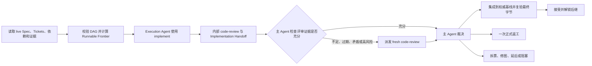

# DAG Skill

`dag-skill` 是一个面向 Agent 的通用协调 Skill，用于持续推进已经批准并拆分完成的 Spec/Ticket 有向无环图。它不负责设计 Spec 或创建初始 Tickets，也不绑定 Markdown、GitHub Issues 等具体载体。

可复制 Skill artifact 位于 [`skill/dag/`](./skill/dag/)，其中的英文 [`SKILL.md`](./skill/dag/SKILL.md) 是唯一运行规范；本文只提供中文定位和使用说明。

## 使用前提

开始前需要能够唯一定位：

- 目标项目；
- 已批准的 Spec；
- 本次纳入范围的 Tickets 及其依赖载体；
- 用户对执行、推进、继续或恢复整个 DAG 的明确授权。

Spec/Ticket 的制定与修改仍由目标项目已有的 authoring Skill 完成。单张孤立 Ticket 的实现也应直接使用相应实施 Skill，而不是触发 DAG 协调。

## 模型与 Agent 选择

Skill 不绑定某个具体模型版本。若用户或目标项目明确指定模型、Agent 或 reasoning effort，它就是当次运行的硬约束；否则，主 Agent 会根据当前真实可用性、角色、Ticket 复杂度、工具和风险选择合适 profile。主 Agent 倾向使用最强的可用全图推理能力，实现与评审 Agent 按实际工作选择，评审必须保持独立上下文，但不强制使用不同模型。

当用户点名模型或询问该选哪些模型时，主 Agent 先核查本地实际可用选项，再按角色给出具体建议和取舍。点名选项不可用、能力不匹配或违反项目约束时，必须先说明原因并得到用户授权才能替换；未点名模型时，只要 Agent 的身份和必需能力有证据支持，就可在公开宿主实际可见元数据以及未暴露字段后继续调度，不会仅因本地缺少某个版本而停止整个 DAG。

## 核心流程

`implement` 内部触发的 `code-review` 是执行侧预审。主 Agent 会检查原始 Standards/Spec 结果、Reviewer 独立性、宿主实际可见 metadata 及明确未暴露字段，以及被审查的最终产物；证据充分时直接用于裁决，只有不足或风险较高时才再次派发独立评审。

所有已派发 Reviewer 都必须终止或被明确替代，且迟到结果已经处理；超时只表示缺少证据，不表示没有问题。

主 Agent 始终拥有 Ticket 接受、返工、拆票、重排和最终验收权。实现 Agent、Reviewer 或绿测声明都不能单独证明完成；Agent 失败时应按预算重新派发或阻塞，不能由主 Agent 接管实现或代替独立评审。

## 调度与有界失败

- Frontier 同时依据依赖、blocker、认领和验收记录权限、Agent 能力以及 workspace 写入安全计算，不能只读取 `ready` 状态。
- 同一 workspace 默认只有一个写入 Agent；只有目标项目提供明确隔离和集成边界时才并行实现。
- `active`、已认领或正在探索只证明任务存在；主 Agent 直接分派的每个 Agent 都设置并记录适合其角色、Ticket 与宿主的有界进展检查点，子 Agent 则负责同样有界地监控它进一步派发的 Agent。检查点必须有可核查的 milestone，例如有效 RED、ticket-scoped diff、候选产物、评审报告、明确 blocker 或终态 handoff。已经授权且可用的宿主持久 Goal 可用于维持运行，但它是可选机制，不能代替 tracker 和 Git 事实。
- 每个 Ticket attempt 在实施、评审和集成阶段共享一次操作性重试；每张 Ticket 最多一次正式返工。
- 同一原始 Ticket lineage 最多自动执行一次保持语义的 DAG Revision；再次修图需要用户明确授权。
- 测试失败必须区分本票回归、带 owner 和关闭条件的既有异常、环境或工具问题以及未验证项；必需门禁的非绿色或未验证结果默认阻塞，不能描述为全绿。
- Ticket 出现第二个独立目标或验收 seam、或者当前 diff 已无法进行有界评审时，立即停止扩张并拆票或修图。未验收的历史 WIP 只作为证据使用。
- 恢复所需证据记录在目标项目既有 tracker 或仓库证据中，不新增 dag-skill 私有状态文件。

跨任务交接只有在接收方重新读取 live 项目并恢复 fixed point、attempt、预算、产物、blocker 和 frontier 后才成立；发送消息或看到任务 active 不足以证明交接成功。

## 集成与失效

通过评审的候选必须先进入目标项目的权威集成基线，并在集成后的最终字节和真实交付边界上复验，随后才能接受 Ticket 并解锁后继。外部关闭状态只在其独立条件与授权同时满足时同步。若集成改变了被评审的字节或评审相关 identity/history，必须重新进行评审充分性判断。原 Ticket 范围内的集成冲突由 Execution Agent 处理并消耗尚未使用的 Formal Rework；返工预算已耗尽或冲突暴露 scope drift 时，才进入 DAG Revision。

外部 `resolved` 状态如果承诺产物已可从指定集成或远端 ref 获取，写入前必须证明可达性；缺少任何必需的远端 tracker 写入或发布授权时，只保留本地验收证据，不改变外部状态。

迟到的有效 finding 或 Whole-DAG 验收失败会使原票及所有消费其输出的已接受后继失效，并暂停受影响子图。主 Agent 应按目标项目契约重新打开原票，或调用 authoring Skill 追加 remediation lineage，而不是直接补丁绕过 DAG。

## Skill 复用与回退

优先显式使用当前安装的 `implement` 和 `code-review`。当 Skill 缺失或其 Git、Spec、tracker 等前置条件在目标项目中不适用时，主 Agent 会公开说明并使用 DAG 内建流程；不会静默跳过测试、独立 Standards/Spec 评审、真实交付边界或最终字节核验。

需要新增或修改 Ticket 时必须调用目标项目的 authoring Skill；`dag-skill` 不提供 Ticket authoring fallback。

## 授权边界

启动整个 DAG 后，可连续执行本地认领、Agent 分派、代码修改、测试、合适场景下的 ticket-scoped commit、本地票据记录和后继解锁。

远端 tracker 写入、push、PR、tag、release、部署、外部 API/数据库写入、状态型远端 CI、破坏性 Git、产品语义或验收变化以及降低门禁，均需单独授权。

## 终态

- `Complete`：有效图中的所有 Tickets 均已集成并接受，并通过 Spec 覆盖、依赖集成、最终产物、项目门禁和 tracker 一致性的整图验收。
- `Stalled`：仍有未完成 Tickets，但没有运行中的 Agent，也没有满足真实调度条件的 Runnable Frontier；每条停止路径都有可核查原因。

`Complete` 只表示本地验收完成，不包含发布授权。

## 调用示例

- “使用 `$dag` 执行 Spec 0008 已批准的 Ticket DAG。”
- “继续推进这个 DAG，自动调度所有可运行 Tickets。”
- “根据 live tracker 和 Git 证据恢复上次的 DAG 执行。”
