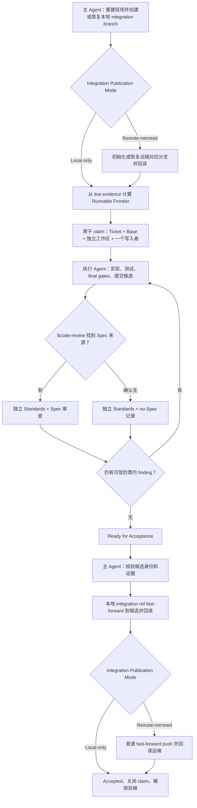

# DAG Skill

`dag-skill` 用来推进 Git-backed 目标项目中已经批准的多 Ticket 依赖图。它把调度保持得很薄：主 Agent 只处理图、授权、验收和集成；一张票内部的实现、测试、审查和 finding 修复由同一个执行责任闭环完成。

可复制的 Skill 位于 [`skill/dag/`](./skill/dag/)：

- [`SKILL.md`](./skill/dag/SKILL.md) 是唯一的规范性运行契约；
- [`CONTEXT.md`](./CONTEXT.md) 定义跨项目使用的正式术语；
- [`docs/DESIGN.md`](./docs/DESIGN.md) 只解释设计取舍和不变量；
- [`scripts/install_dependencies.py`](./skill/dag/scripts/install_dependencies.py) 是兼容保留的可选支持 Skill 安装器，不是开跑门禁。

## 稳定推进路径



默认串行推进；只有硬依赖和写入边界都独立时才并行。所有推广仍经过一条串行集成通道。

本地 integration branch 创建或恢复时固定一次发布模式。选择 Remote-mirrored 时，同时选择一个已配置的 remote 和对应 branch；默认使用本地 integration branch 的同名远端分支。启动时执行一次普通 `git push -u`：远端分支不存在就创建，落后就快进，已经一致就确认 upstream；随后回读必须等于本地 tip。这个运行级选择同时授权后续每个里程碑对同一分支执行普通 fast-forward push 和 SHA 回读，不再逐票询问。只同步 integration branch，不自动发布 Ticket 分支、`main`、PR、tag 或 release。

Ticket 是验收工作单元，DAG Milestone 是它被接受后留下的 Git 集成状态。一个非空候选先 fast-forward 到本地 integration branch；Remote-mirrored 再同步到选定远端分支并回读。全部检查完成后，该 commit/tree 才成为新的 Milestone 和后继 Ticket Base。Ticket 分支候选、中间 commits、Zero-diff Accepted 和 Superseded 都不产生新 Milestone。

Remote-mirrored 的恢复只有一个目标：让选定远端分支等于已经本地推广的候选。进程在 push 前中断、push 失败或响应丢失时，候选保持 `pending remote sync`，Ticket 不 Accepted、后继不解锁、下一张票不 claim。恢复时先回读：已经相等就直接完成验收；尚未发送就发送；响应丢失且仍未同步就重发一次；非快进就报告双方身份并等待对账；其他明确错误先修正原因。丢响应重发前先在 Run Receipt 关闭该 Candidate 的自动 push。只要远端仍不是 Candidate 且标记缺失、已关闭或不确定，就不再自动 push，立即记录 owner 与可观察的 recheck 条件；纠因重试同错也如此。始终使用同一条普通 fast-forward push，不 force push、不自动换分支，也不触发 DAG Revision。

## 责任边界

| 角色 | 负责 | 不负责 |
| --- | --- | --- |
| **Coordinator Agent** | live DAG、frontier、claim、Base/工作区分配、图与授权决策、推广、Accepted、后继解锁 | Ticket 实现、finding 修复、重复工程审查 |
| **Execution Agent** | 一张 Ticket 的实现、TDD、门禁、提交、调用 `$code-review`、关闭票内 findings | 修改 DAG、写集成分支、标记 Accepted、远端发布、其他 Ticket |

`$code-review` 创建的 Standards 及有权威来源时的 Spec 审查上下文是它的内部实现，不是第三种 DAG 角色。确认不存在 Spec 来源时，采用该 Skill 的 no-Spec 记录，而不是把票误判为缺少能力。DAG 保存的是一条候选审查记录：Base、候选 commit/tree、评估范围以及完整审查结果。审查文本本身不需要重复编码这些身份。

执行 Agent 最终只通过三个接口结果与主 Agent 交互：

| 结果 | 用途 |
| --- | --- |
| **Ready for Acceptance** | 已审查候选可精确推广，或已有规则明确接受完整的 baseline-satisfaction 证据 |
| **Needs Coordinator Decision** | 需要一个依赖、验收归属、产品语义、scope、图或授权选择 |
| **Externally Blocked** | 选择已经确定，但凭据、服务、硬件、宿主能力或授权条件尚未满足 |

普通缺陷、测试失败、审查 finding、命令修正和多轮候选都留在同一 Ticket 执行闭环。没有固定修复次数；每一轮必须关闭 finding、针对具名 finding 或失败探针改变候选、修复必需门禁，或把剩余问题归结为一个具名决策/外部关闭条件。完全没有可观察进展时立即返回对应结果，不空转。

## 关键推进规则

| 情况 | 处理方式 |
| --- | --- |
| 并行推广使 Base 过期 | 主 Agent 显式签发等于最新 Accepted tip 的新 Base；原执行责任在原工作区刷新候选、门禁和完整审查。旧证据保留但不再用于推广 |
| Ticket Base 已满足该票且 diff 为空 | 已有规则且证据完整时返回 Ready for Acceptance；转移前串行回读 commit/tree 和所选发布模式仍与审计 Base 一致，否则按漂移或远端分歧分别处理 |
| 存在 remote，但发布模式尚未选择 | 在首张票 claim 前选择 Local-only 或 Remote-mirrored；remote 的存在本身不授权 push |
| 没有 remote，但项目要求远端同步 | 等待配置并选择一个 remote/branch 后再派票 |
| Remote-mirrored 初始化 | 普通 `git push -u` 创建或快进对齐远端 branch，回读等于本地 tip 后开始派票 |
| 初始化 push 非快进或回读不一致 | 报告本地和远端 SHA，等待对账或选择新 branch；不 force push |
| 里程碑 push 失败或响应丢失 | 保留本地候选为 pending remote sync；回读并完成同步后才 Accepted 和继续下一票 |
| 里程碑 push 被非快进拒绝 | 报告双方 SHA，等待明确处理；不自动换 ref，也不触发 DAG Revision |
| 恢复时无法确认旧写入者是否仍存活 | 保留 claim 和工作区，通过恢复联系、确认停止或获授权的宿主终止建立静止边界；在此之前只推进图独立工作，不从沉默推断死亡 |

推广只接受从记录 Base 到已审查候选的 fast-forward。主 Agent 在推广前再次核对 Accepted tip、候选祖先关系、commit/tree、diff、final-byte gates、全部 finding 的证据化处置和候选审查记录；推广后回读精确身份并关闭 claim。任何对交付字节的修改都必须形成新候选并重新审查。

Run Receipt 必须位于交付历史之外，例如目标项目 Tracker、独立 coordination ref/worktree 或明确的本地元数据位置。它不能通过“记录验收”再次改变刚完成审查和推广的 artifact identity。

## 图变化和终态

DAG Revision 只由真实图条件触发：缺失前置、错误依赖、验收义务分配给了错误 Ticket，或多个可独立验收的交付结果。候选数、审查数、diff 大小或工具错误本身不能触发修图。进入串行验收事务前，主 Agent 最后核对图、候选证据和 Base；进入后保持这些输入不变，完成本地推广、所选远端同步和 Accepted，再立即处理期间新到的图证据。其他已 claim Ticket 若需替换，则先确认原写入者停止并保留 worktree/WIP，再原子记录 Superseded 与 close claim，之后才能派发替代票。

- **Complete**：所有有效 Ticket 都已 Accepted，被 Superseded 的票已妥善归属其验收义务，没有 active claim，且整图门禁、依赖消费和所选发布模式一致；Remote-mirrored 还要求本地 tip 与远端回读完全相等。
- **Stalled**：写入者状态已查清、没有未决的 Needs Coordinator Decision，且未完成工作没有运行中 Agent、Runnable Ticket、获授权恢复、图修正、独立工作或当前可满足的外部关闭条件。待选择的问题保持 decision-needed，不伪装成 Stalled。

## 授权

执行 DAG 通常包含本地 claim、隔离工作区、派发、票内编辑、测试、提交、本地推广和本地证据。选择 Remote-mirrored 时，用户一次授权选定 integration ref 在本次运行中的创建、逐里程碑 fast-forward push 和回读，不再逐里程碑询问。其他 push、远端 Tracker/PR、tag、release、部署、远端 CI、外部写入、破坏性 Git、产品语义或验收变化仍需分别授权。

## 可选安装器

用户单独授权时，兼容安装器可以安装固定版本的 `tdd`、`code-review`、`codebase-design` 和 `setup-matt-pocock-skills`：

```bash
python3 /path/to/dag/scripts/install_dependencies.py \
  --skills-root /path/to/agent-host/skills
```

安装器要求 Python 3.12+，保留冲突预检和内容校验。运行 DAG 仍以当前宿主真正可用的目标项目工具和 `$code-review` 能力为准。

## 调用示例

- “使用 dag Skill 执行 Spec 0008 已批准的 Ticket DAG。”
- “继续推进这个 DAG；每张票由一个执行 Agent 闭环处理审查 finding。”
- “从最新的 Ticket、Git、worktree 和测试证据恢复 DAG。”
