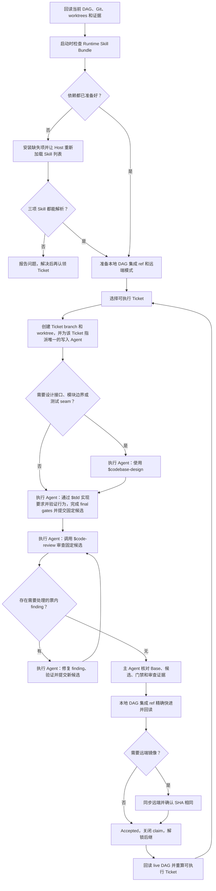

# DAG Skill

`dag-skill` 用来推进 Git 项目中已经批准的多 Ticket 依赖图。主 Agent 负责看清现场、按依赖派票、验收结果并更新 DAG 集成分支；执行 Agent 一次只负责一张 Ticket，完成实现、测试、审查和 finding 修复。

可复制的 Skill 位于 [`skill/dag/`](./skill/dag/)：

- [`SKILL.md`](./skill/dag/SKILL.md) 是运行规范；
- [`CONTEXT.md`](./CONTEXT.md) 定义共用术语；
- [`docs/DESIGN.md`](./docs/DESIGN.md) 解释设计理由和异常处理；
- [`install_dependencies.py`](./skill/dag/scripts/install_dependencies.py) 补齐 DAG 运行所需的 Skill 依赖。

它只执行已经批准的 DAG，不替代目标项目编写 Spec 或 Ticket。

## 开始 DAG 时做什么

Runtime Skill Bundle 固定包含 `tdd`、`codebase-design` 和 `code-review`。每次开始或恢复 DAG，主 Agent 按下面的顺序处理：

1. 回读目标项目当前的指令、Spec、Tickets、依赖、tracker、Git 状态、branches、worktrees、测试和已有证据。
2. 完成 Runtime Skill Bundle 的启动检查：确认三项 Skill 均可由当前 Agent Host 解析，且内容与 DAG 固定的版本一致。任一成员缺失或不匹配时，运行安装器：

   ```bash
   python3 /path/to/dag/scripts/install_dependencies.py \
     --skills-root /path/to/agent-host/skills
   ```

   预检将三个目标分别判定为 `current`、`missing` 或 `conflicting`；版本不同、内容不完整、普通文件和符号链接均属于冲突。有冲突时，保留现状并报告；无冲突时，获取固定 revision、复用内容完全一致的目录、创建缺失目录，并在结束前校验结果。安装期间遇到并发占用、复制或校验失败时，保留已完成目录和已预留现场供检查。安装成功后，让 Agent Host 重新加载 Skill 列表并确认三项均可解析。启动检查完成后，本次运行的后续 Ticket 直接使用已验证的 Bundle；运行环境中途发生变化时，按普通工具失败处理。
3. 创建或恢复本次运行的本地 DAG 集成分支，并确认它指向当前已验收的集成 commit。
4. 在派发首张 Ticket 前确定本次运行是否同步远端。首次使用一个远端映射时，完成初始化并回读 SHA；恢复已有映射时，按记录只读对账。
5. 根据当前依赖和 blocker 计算可执行的 Tickets，然后进入下面的 DAG 推进循环。

## DAG 怎么推进



默认一次推进一张 Ticket。只有 Ticket 之间没有硬依赖，而且写入范围确实独立时才并行；验收和集成始终串行。

执行 Agent 只返回三种结果：

| 结果                           | 直白含义                                                         |
| ------------------------------ | ---------------------------------------------------------------- |
| `Ready for Acceptance`       | 候选和证据已经齐全，主 Agent 可以按既有规则验收                  |
| `Needs Coordinator Decision` | 还缺一个依赖、范围、产品含义、图结构、验收或授权决定             |
| `Externally Blocked`         | 决定已经明确，但凭据、服务、硬件、宿主能力或已有授权条件尚未满足 |

普通代码问题、失败测试、审查 finding、候选轮次和 diff 大小都由同一个执行 Agent 在当前 Ticket 内闭环处理。

只有现场证据证明 DAG 边界有误，才进入 DAG 修订。需要新建、替换或调整 Ticket 时，按目标项目已有规则处理；规则或授权不明确时，先请求决定。

## 几条必须守住的规则

- Ticket 的 Base、最终 candidate commit/tree、diff、final gates 和 `$code-review` 结果必须指向同一份代码。
- 如果其他 Ticket 先被接受，导致 Base 过期，主 Agent 把最新 Accepted tip 作为新 Base 交回原 Ticket；执行 Agent 刷新候选、门禁和审查。
- 主 Agent 只把本地 DAG 集成 ref 从准确的 Base 原子快进到准确的 Candidate，并回读 commit/tree；审查完成后保持交付字节不变。若该分支已被某个 worktree 签出，先完成对账再派票或集成。
- 如果 Base 已经满足 Ticket 且 diff 为空，只有目标项目已有明确的 baseline-satisfaction 规则并且证据完整时才能验收；否则请求决定，不制造空提交，也不对空 diff 调用 `$code-review`。
- 一张 Ticket 同时只能有一个写入 Agent。如果需要换 Agent，先确认原 Agent 已停止，再把原 Ticket、branch、worktree 和 WIP 交给新 Agent 继续。
- Run Receipt 保存在交付历史之外，只记录 Accepted tip、claims、Base/Candidate/Workspace、远端状态、结果和待解决条件；验收记录必须保持已审查的代码身份不变。

## 远端怎么处理

远端镜像范围限定为 DAG 集成分支；发布 Ticket branches、`main`、PR、tag 或 release 需要单独授权。

主 Agent 在派发首张 Ticket 前一次处理好发布模式：

| 当前情况                                             | 处理方式                                                                               |
| ---------------------------------------------------- | -------------------------------------------------------------------------------------- |
| 目标项目或 Run Receipt 已记录模式                    | 继续使用原模式                                                                         |
| 用户明确要求同步，且只有一个明确的 remote            | 直接选择`Remote-mirrored`                                                            |
| 用户说“有 remote 就同步”                           | 恰好一个 remote 时同步；没有 remote 时使用`Local-only`；多个 remote 时只问一次选哪个 |
| 用户明确要求同步，但 remote 或 branch 有多个合理选择 | 只问一次缺少的选择                                                                     |
| 已配置 remote，但用户和项目都没说是否同步            | 只问一次选择`Local-only` 还是 `Remote-mirrored`                                    |
| 没有 remote，也没有同步要求                          | 直接使用`Local-only`                                                                 |
| 必须同步，但还没有 remote                            | 只问一次 remote 名称、URL 和执行`git remote add` 的授权；配置并初始化完成后才派票    |

`Remote-mirrored` 默认使用与本地 DAG 集成分支同名的专用远端分支。写 `main`、默认分支或受保护分支需要单独明确授权；如果该分支只允许走 PR，DAG 在派票前报告该约束，采用 PR 流程需另行决定。

只有当前运行第一次选择某个远端映射，而且现场和恢复记录都能证明它从未初始化时，主 Agent 才用普通 `git push -u` 创建或快进远端集成分支，然后读取完整远端 ref。只有远端 SHA 与本地 tip 完全相同，才把它记为上次同步 commit 并开始派票。

恢复已有映射时，先只读对账。没有待同步 Candidate 时，本地 Accepted tip 和远端 SHA 都必须等于记录的上次同步 commit；有待同步 Candidate 时，直接使用下面的对账规则。远端 ref 消失、SHA 不同或记录不完整都视为漂移或未解决的恢复状态，报告后等待明确对账。

后续每个候选先更新本地 DAG 集成 ref，再按下面的规则同步：

1. 先读远端 ref；已经等于 Candidate 就直接完成。
2. 远端仍等于上次同步的 commit，才执行普通 fast-forward push，再读一次。
3. 远端 ref 消失或变成其他 SHA，视为远端漂移；保持远端不变，报告三方身份并等待对账。
4. push 或读取失败时保留 `pending remote sync`；恢复时重新从“先读远端 ref”开始。

远端确认 Candidate 后，才将这张 Ticket 标记为 Accepted、解锁后继、开始下一张 Ticket 或推广另一个候选。同步始终使用普通 fast-forward push 和固定的 branch 映射。

## 授权与结束条件

一次 DAG 执行授权通常覆盖：安全补齐 Runtime Skill Bundle 的缺失成员、本地 claim、创建隔离 worktree、派发 Agent、票内编辑和测试、候选提交、本地集成与本地验收证据。

替换已有 Skill、安装或运行可选的项目配置工具、执行 `git remote add`、写默认或受保护分支、其他 push、远端 tracker/PR、tag、release、部署、远端 CI、外部写入、破坏性 Git、修改产品含义或放宽门禁，都需要对应的明确授权。

- `Complete`：所有有效 Ticket 都已 Accepted，被替换 Ticket 的验收责任已有归属，没有活动 claim，整图门禁和依赖消费一致；如果选择远端镜像，远端 SHA 也必须等于本地 Accepted tip。
- `Stalled`：所有写入者状态都已查清，没有等待回答的决定，而且未完成工作确实没有运行中 Agent、可执行 Ticket、获授权恢复、图修正、独立工作或当前可满足的外部条件。

## 调用示例

- “使用 dag Skill 执行 Spec 0008 已批准的 Ticket DAG。”
- “继续推进这个 DAG；缺失的运行依赖按默认流程安装。”
- “从最新的 Ticket、Git、worktree 和测试证据恢复 DAG。”
