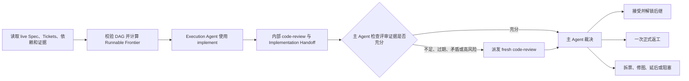

# DAG Skill

`dag-skill` 是一个面向 Agent 的通用协调 Skill，用于持续推进已经批准并拆分完成的 Spec/Ticket 有向无环图。它不负责设计 Spec 或创建初始 Tickets，也不绑定 Markdown、GitHub Issues 等具体载体。

英文 [`SKILL.md`](./SKILL.md) 是唯一运行规范；本文只提供中文定位和使用说明。

## 使用前提

开始前需要能够唯一定位：

- 目标项目；
- 已批准的 Spec；
- 本次纳入范围的 Tickets 及其依赖载体；
- 用户对执行、推进、继续或恢复整个 DAG 的明确授权。

Spec/Ticket 的制定与修改仍由目标项目已有的 authoring Skill 完成。单张孤立 Ticket 的实现也应直接使用相应实施 Skill，而不是触发 DAG 协调。

## 核心流程

`implement` 内部触发的 `code-review` 是执行侧预审。主 Agent 会检查原始 Standards/Spec 结果、Reviewer 独立性、真实模型元数据以及被审查的最终产物；证据充分时直接用于裁决，只有不足或风险较高时才再次派发独立评审。

主 Agent始终拥有 Ticket 接受、返工、拆票、重排和最终验收权。实现 Agent、Reviewer 或绿测声明都不能单独证明完成。

## 调度与有界失败

- Frontier 同时依据依赖、blocker、认领和验收记录权限、Agent 能力以及 workspace 写入安全计算，不能只读取 `ready` 状态。
- 同一 workspace 默认只有一个写入 Agent；只有目标项目提供明确隔离和集成边界时才并行实现。
- 每次实现尝试最多有一次操作性重试；每张 Ticket 最多一次正式返工。
- 同一原始 Ticket lineage 最多自动执行一次保持语义的 DAG Revision；再次修图需要用户明确授权。
- 恢复所需证据记录在目标项目既有 tracker 或仓库证据中，不新增 dag-skill 私有状态文件。

## Skill 复用与回退

优先显式使用当前安装的 `implement` 和 `code-review`。当 Skill 缺失或其 Git、Spec、tracker 等前置条件在目标项目中不适用时，主 Agent 会公开说明并使用 DAG 内建流程；不会静默跳过测试、独立 Standards/Spec 评审或最终字节核验。

需要新增或修改 Ticket 时必须调用目标项目的 authoring Skill；`dag-skill` 不提供 Ticket authoring fallback。

## 授权边界

启动整个 DAG 后，可连续执行本地认领、Agent 分派、代码修改、测试、合适场景下的 ticket-scoped commit、本地票据记录和后继解锁。

远端 tracker 写入、push、PR、tag、release、部署、外部 API/数据库写入、状态型远端 CI、破坏性 Git、产品语义或验收变化以及降低门禁，均需单独授权。

## 终态

- `Complete`：有效图中的所有 Tickets 均已接受，并通过 Spec 覆盖、依赖集成、最终产物、项目门禁和 tracker 一致性的整图验收。
- `Stalled`：仍有未完成 Tickets，但没有运行中的 Agent，也没有满足真实调度条件的 Runnable Frontier；每条停止路径都有可核查原因。

`Complete` 只表示本地验收完成，不包含发布授权。

## 调用示例

- “使用 dag-skill 执行 Spec 0008 已批准的 Ticket DAG。”
- “继续推进这个 DAG，自动调度所有可运行 Tickets。”
- “根据 live tracker 和 Git 证据恢复上次的 DAG 执行。”
