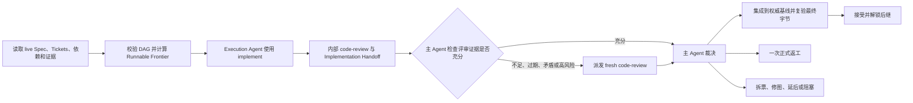

# DAG Skill

`dag-skill` 是一个面向 Agent 的通用协调 Skill，用于持续推进已经批准并拆分完成的 Spec/Ticket 有向无环图。它不负责设计 Spec 或创建初始 Tickets，也不绑定某个 Agent 宿主、模型、Markdown、GitHub Issues 等具体实现。

可复制 Skill artifact 位于 [`skill/dag/`](./skill/dag/)；其中的英文 [`SKILL.md`](./skill/dag/SKILL.md) 是唯一 DAG 运行规范，[`agents/openai.yaml`](./skill/dag/agents/openai.yaml) 是可选的 OpenAI/Codex 界面元数据，[`scripts/install_dependencies.py`](./skill/dag/scripts/install_dependencies.py) 是只在单独授权后使用的依赖安装助手。本文只提供中文定位和使用说明。

## 使用前提

开始前需要能够唯一定位：

- 目标项目；
- 已批准的 Spec；
- 本次纳入范围的 Tickets 及其依赖载体；
- 用户对执行、推进、继续或恢复整个 DAG 的明确授权。

Spec/Ticket 的制定与修改仍由目标项目已有的 authoring Skill 完成。单张孤立 Ticket 的实现也应直接使用相应实施 Skill，而不是触发 DAG 协调。

## Agent 宿主兼容性

运行规范采用开放的 [Agent Skills 格式](https://agentskills.io/specification)：`SKILL.md` 只使用标准 frontmatter，并通过 Skill 名称和能力描述表达依赖，不绑定固定安装目录、mention 前缀、斜杠命令或某个厂商的 Agent API。`agents/openai.yaml` 只增强支持该格式的 OpenAI/Codex 界面，其他宿主可以忽略；依赖安装脚本要求调用方显式提供宿主文档规定的 Skill 目录，不负责猜测宿主。具体如何发现、选择或显式激活 Skill，仍由当前宿主的原生机制决定。

这里承诺的是**契约可移植性**，不是宣称任意聊天工具都能完整执行该流程。一个受支持的 Agent 宿主至少需要能够：

- 读取并显式激活具名 Skill；
- 派发具有全新、相互隔离上下文的 Agent；
- 建立实现侧可写、评审侧只读的工作边界；
- 观察 Agent 的存活、进展检查点和终态；
- 访问目标项目的 tracker、仓库和验证工具。

宿主不支持并行时可以串行调度；缺少角色隔离、可观察终态或其他必需能力时，主 Agent 会在认领 Ticket 前报告能力缺口并停止受影响路径，不会在同一污染上下文中伪装独立评审。

## 必需 Skill 依赖

`dag` 的受支持执行环境必须预先安装以下四个完整 Matt Skill 目录：

- `implement`
- `code-review`
- `tdd`
- `codebase-design`

默认版本固定为 [`mattpocock/skills@5b15a47f2d7150f545fbcacbfe381787fc0230dc`](https://github.com/mattpocock/skills/tree/5b15a47f2d7150f545fbcacbfe381787fc0230dc/skills/engineering)。`skills/engineering/<name>` 只是这些 Skill 在 Matt 仓库里的上游来源路径；安装时会去掉 `engineering` 分组，直接得到 `<host-skills-root>/<name>`。因此宿主的 `skills` 根目录下会直接出现 `implement/`、`code-review/`、`tdd/` 和 `codebase-design/`。不能只复制 `SKILL.md`：`tdd` 还需要 `tests.md` 和 `mocking.md`，`codebase-design` 还需要 `DEEPENING.md` 和 `DESIGN-IT-TWICE.md`。

用户单独授权安装并明确宿主的 Skills 根目录后，可以运行随 artifact 提供的助手：

```bash
python3 /path/to/dag/scripts/install_dependencies.py \
  --skills-root /path/to/agent-host/skills
```

该脚本只依赖 Python 标准库、Git 和网络，始终从固定 revision 复制上述四个完整目录。它不会安装 `setup-matt-pocock-skills`，不会猜测宿主目录，也没有覆盖选项：目标不存在时安装、与固定源完全相同时幂等跳过，任何目标不同、为文件或为软链接时都会在写入前停止整批操作。若脚本不可用，应按同一固定 revision 和完整目录契约手工安装，而不是降低依赖门禁。

每次开始或恢复 DAG 时，主 Agent 都会在认领 Ticket 或派发 Agent 前核查四个 Skill 的准确名称、唯一解析标识或位置、完整资源、固定内容身份、可显式激活性和实际契约。只核查宿主实际暴露的策略与来源字段，不假定某个厂商扩展必然存在。任一 Skill 缺失、禁用或不可激活、同名冲突、内容不匹配或资源不完整都会使运行停在依赖检查阶段；缺失依赖不能转成 DAG 内建回退，也不消耗 Ticket 的操作性重试。普通 DAG Run Authorization 不允许安装、注册、更新或覆盖用户 Skill；只有用户另行授权并明确目标目录时才能使用安装助手，修复后仍必须重新读取并验证整个依赖集合。

`setup-matt-pocock-skills` 不属于必需集合，也不会自动安装或激活，因为它会配置目标项目。若已安装的 `code-review` 因宿主能力或目标项目缺少其 tracker 前置条件而不适用，主 Agent 使用 DAG 内建双轴评审；只有用户另行授权时才可运行项目配置 Skill。

Review Agent、Standards Reviewer 和 Spec Reviewer 都是主流程派发的 Agent 角色，不是额外 Skill，因此不存在需要安装的 `reviewer` Skill。`triage`、`to-spec`、`to-tickets` 和 `domain-modeling` 也不属于 DAG 执行依赖。

## 模型与 Agent 选择

Skill 不绑定某个 Agent 宿主或具体模型版本。若用户或目标项目明确指定模型、Agent 或 reasoning effort，它就是当次运行的硬约束；否则，主 Agent 会根据当前真实可用性、角色、Ticket 复杂度、工具和风险选择合适 profile。主 Agent 倾向使用最强的可用全图推理能力，实现与评审 Agent 按实际工作选择，评审必须保持独立上下文，但不强制使用不同模型。

当用户点名模型或询问该选哪些模型时，主 Agent 先核查当前宿主实际可用的选项，再按角色给出具体建议和取舍。点名选项不可用、能力不匹配或违反项目约束时，必须先说明原因并得到用户授权才能替换；未点名模型时，只要 Agent 的身份和必需能力有证据支持，就可在明确记录宿主可见元数据和未暴露字段后继续调度，不会仅因当前宿主缺少某个模型版本而停止整个 DAG。

## 核心流程



`implement` 内部触发的 `code-review` 是执行侧预审。主 Agent 会检查原始 Standards/Spec 结果、Reviewer 独立性、宿主实际可见 metadata 及明确未暴露字段，以及被审查的最终产物；证据充分时直接用于裁决，只有不足或风险较高时才再次派发独立评审。

所有已派发 Reviewer 都必须终止或被明确替代，且迟到结果已经处理；超时只表示缺少证据，不表示没有问题。

主 Agent 独占 Ticket 认领、tracker/DAG 状态、候选集成、接受、返工、拆票、重排和最终验收权。实现 Agent 只能修改获准的 Ticket workspace，Reviewer 保持只读；两者及其子 Agent 只返回产物和证据，不能接受 Ticket、修改 tracker/DAG 状态或解锁后继。Agent 失败时应按预算重新派发或阻塞，不能由主 Agent 接管实现或代替独立评审。

## 调度与有界失败

- Frontier 只包含尚未接受的 Ticket，并同时依据依赖、blocker、认领和验收记录权限、Agent 能力以及 workspace 写入安全计算，不能只读取 `ready` 状态；主 Agent 只选择直接及嵌套 Agent 峰值需求不超过当前容量的最大安全子集，需求不明确时串行推进。
- 同一 workspace 默认只有一个写入 Agent；Execution Agent 的候选 commit 不得在裁决前推进权威集成基线，只有目标项目提供明确隔离和集成边界时才并行实现。
- `active`、已认领或正在探索只证明任务存在；主 Agent 直接分派的每个 Agent 都设置并记录适合其角色、Ticket 与宿主的有界进展检查点，子 Agent 则负责同样有界地监控它进一步派发的 Agent。检查点必须有可核查的 milestone，例如有效 RED、ticket-scoped diff、候选产物、评审报告、明确 blocker 或终态 handoff。已经授权且可用的宿主持久 Goal 可用于维持运行，但它是可选机制，不能代替 tracker 和 Git 事实。
- 每个 Ticket attempt 在实施、评审和集成阶段共享一次操作性重试；每张 Ticket 最多一次正式返工。
- 同一原始 Ticket lineage 最多自动执行一次保持语义的 DAG Revision；再次修图需要用户明确授权。
- 测试失败必须区分本票回归、带 owner 和关闭条件的既有异常、环境或工具问题以及未验证项；必需门禁的非绿色或未验证结果默认阻塞，不能描述为全绿。
- Ticket 出现第二个独立目标或验收 seam、或者当前 diff 已无法进行有界评审时，立即停止扩张并拆票或修图。未验收的历史 WIP 只作为证据使用。
- 恢复所需证据记录在目标项目既有 tracker 或仓库证据中，不新增 dag-skill 私有状态文件。

跨任务交接只有在接收方重新读取 live 项目、恢复完整 Recovery Evidence（包括 fixed point、attempt、预算、产物、权威集成基线、候选可达性，以及绑定产物身份的集成门禁命令、环境和结果）并重新计算 frontier 后才成立；发送消息或看到任务 active 不足以证明交接成功。

## 集成与失效

通过评审的候选必须先进入目标项目的权威集成基线，并在集成后的最终字节和真实交付边界上复验，随后才能接受 Ticket 并解锁后继。外部关闭状态只在其独立条件与授权同时满足时同步。若集成改变了被评审的字节或评审相关 identity/history，必须重新进行评审充分性判断。原 Ticket 范围内的集成冲突由 Execution Agent 处理并消耗尚未使用的 Formal Rework；返工预算已耗尽或冲突暴露 scope drift 时，才进入 DAG Revision。

外部 `resolved` 状态如果承诺产物已可从指定集成或远端 ref 获取，写入前必须证明可达性；缺少任何必需的远端 tracker 写入或发布授权时，只保留本地验收证据，不改变外部状态。

迟到的有效 finding 或 Whole-DAG 验收失败会使原票及所有消费其输出的已接受后继失效，并暂停受影响子图。主 Agent 应按目标项目契约重新打开原票，或调用 authoring Skill 追加 remediation lineage，而不是直接补丁绕过 DAG。

## Skill 复用与回退

Required Skill Bundle 通过检查后，Execution Agent 必须通过当前宿主的原生机制显式激活并使用其中的 `implement`，其嵌套使用必须解析到同一集合中的 `tdd`、需要时的 `codebase-design` 和 `code-review`，而不依赖固定调用语法。只有当已验证的 Skill 因当前宿主能力或目标项目的 Git、Spec、tracker、安全边界而不适用时，主 Agent 才会公开说明并使用 DAG 内建流程；即使 `implement` 不适用，原生实施分支仍显式激活 `tdd`，并在 seam 形状需要设计时激活 `codebase-design`。流程不会把依赖缺失伪装成回退，也不会跳过测试、独立 Standards/Spec 评审、真实交付边界或最终字节核验。

需要新增或修改 Ticket 时必须调用目标项目的 authoring Skill；`dag-skill` 不提供 Ticket authoring fallback。

## 授权边界

启动整个 DAG 后，可在目标项目允许时连续执行本地认领、Agent 分派、创建和使用非破坏性的 ticket-scoped 本地 candidate branch/worktree、代码修改、测试、合适场景下的 ticket-scoped commit、本地票据记录和后继解锁。

远端 tracker 写入、push、PR、tag、release、部署、外部 API/数据库写入、状态型远端 CI、破坏性 Git、产品语义或验收变化以及降低门禁，均需单独授权。

## 终态

- `Complete`：有效图中的所有 Tickets 均已集成并接受，并通过 Spec 覆盖、依赖集成、最终产物、项目门禁和 tracker 一致性的整图验收。
- `Stalled`：仍有未完成 Tickets，但没有运行中的 Agent，也没有满足真实调度条件的 Runnable Frontier；每条停止路径都有可核查原因。

`Complete` 只表示本地验收完成，不包含发布授权。

## 调用示例

- “使用 dag Skill 执行 Spec 0008 已批准的 Ticket DAG。”
- “继续推进这个 DAG，自动调度所有可运行 Tickets。”
- “根据 live tracker 和 Git 证据恢复上次的 DAG 执行。”
