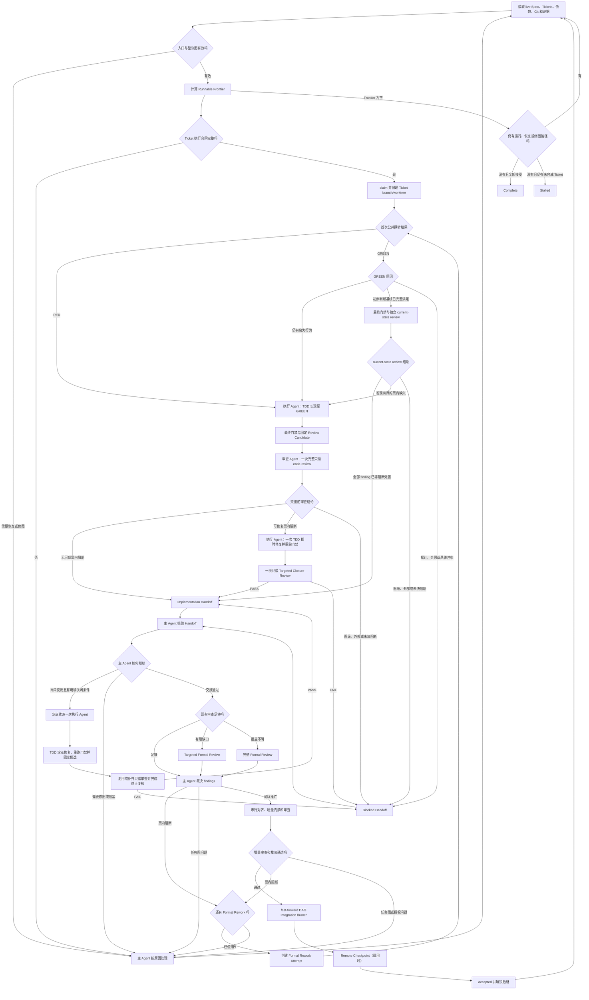

# DAG Skill

`dag-skill` 是一个可以跨项目、跨 Agent 宿主复用的协调 Skill，用来持续推进一个已经设计并批准好的任务图（Ticket DAG）。这里的 DAG 是有向无环图：每张 Ticket 是一个节点；当后一张 Ticket 必须使用前一张 Ticket 已验收的产物时，两者之间才有一条依赖边。

运行时，主 Agent 会反复读取项目的真实状态，找出当前可以开始的 Tickets，派发执行 Agent，核验实施和审查证据，把通过验收的改动合入本次 DAG 的集成分支，再解锁后继 Tickets。这个循环会一直继续，直到整张图完成，或者已有证据证明当前无法再推进。

DAG Skill 负责执行和协调整张图。Spec 与 Ticket 的制定、拆分和内容修订继续遵循目标项目原有的流程。

可安装的 Skill 位于 [`skill/dag/`](./skill/dag/)：[`SKILL.md`](./skill/dag/SKILL.md) 定义准确的运行规则，[`scripts/install_dependencies.py`](./skill/dag/scripts/install_dependencies.py) 安装固定版本的支持 Skills，[`agents/openai.yaml`](./skill/dag/agents/openai.yaml) 提供可选的宿主界面信息。

运行规范采用开放的 [Agent Skills 格式](https://agentskills.io/specification)，任何能够提供所需 Agent 隔离、项目访问和验证能力的宿主都可以接入。

## 项目文档

- [`docs/DESIGN.md`](./docs/DESIGN.md)：解释设计选择、角色边界和状态变化。
- [`CONTEXT.md`](./CONTEXT.md)：记录运行规范中使用的正式术语。
- [`CHANGELOG.md`](./CHANGELOG.md)：记录各版本的用户可见变化。

## 开始一次 DAG 运行

开始或恢复运行时，主 Agent 会先从项目的 Spec、Ticket 系统、Git 和测试证据中确认以下信息。能够从现场确认的内容由主 Agent 直接读取，只有无法唯一判断的部分才需要用户补充。

1. **目标项目**：这次工作对应的仓库，以及实际要操作的分支或工作树。
2. **已批准的 Spec**：已经确认可以实施的需求或设计，而不是仍在讨论的草稿。
3. **本次 Tickets、依赖关系及其权威来源**：要推进哪些 Tickets，以及 Ticket 内容、状态和依赖记录在哪里。它可以是仓库内的 Markdown、GitHub Issues、Jira 或目标项目采用的其他系统。
4. **每张 Ticket 的执行合同**：从已批准内容中明确这张票负责的验收约束、直接使用的前置产物、对外产物、每项验收要求与公开测试探针的对应关系、范围和最终门禁；已批准内容定义了状态变化、等价分类或禁止结果时一并记录。公开验收入口可以是 CLI 命令、HTTP API、公开函数、配置接口或输出校验器；它说明从哪里触发和观察目标行为。
5. **整张 DAG 的运行授权**：用户已经同意主 Agent 执行、继续或恢复这批 Tickets。该授权覆盖正常的本地协调操作；远端发布和其他高影响操作使用单独授权。

Git 项目还会确认本次工作的起点和 DAG 集成分支。项目存在可写远端仓库（remote）时，主 Agent 会明确远端名称、远端 DAG 分支，以及本次运行是否允许在里程碑处推送该分支。

宿主需要能够派发彼此隔离的 Agent、为执行 Agent 提供可写工作区、为审查 Agent 提供只读边界，并允许主 Agent 观察 Agent 状态和访问目标项目的 Ticket 系统、仓库及验证工具。宿主只支持串行派发时，DAG 也可以串行运行。

## 三类 Agent

一次 DAG 运行只使用三种 Agent 角色。角色类型是固定的，执行 Agent 和审查 Agent 可以根据并行 Ticket 和审查范围创建多个实例。

| 角色 | 责任 |
| --- | --- |
| **主 Agent（`Coordinator Agent`）** | 每次 DAG 运行一个；负责现场对账、计算可执行节点、调度、证据裁决、集成、正式返工、调整任务图和最终验收。 |
| **执行 Agent（`Execution Agent`）** | 一个实例只推进一张 Ticket；在一次有限派发中完成 TDD 或确认基线已满足、最终检查、交接前审查和最多一次即时修复，然后返回实施交接或阻塞交接。 |
| **审查 Agent（`Review Agent`）** | 独立审查一个固定候选对象，覆盖 Standards、Spec 或明确的定向范围，并返回发现和证据。 |

主 Agent 决定 Ticket 是否接受、是否定点继续、正式返工以及任务图如何继续。执行 Agent 负责实现和修复；审查 Agent 保持只读和独立，只返回 findings 与证据。`Ticket Worker Protocol` 和 `Worker Self-Check` 是执行 Agent 的工作流程，Standards 和 Spec 是审查 Agent 的审查轴。

## 需要的支持 Skills

DAG 运行使用三个固定版本的 Matt Skills：

- `tdd`：从 Ticket 的公开验收入口开始，用测试驱动实施；
- `code-review`：对固定的候选提交分别进行 Standards 和 Spec 审查；
- `codebase-design`：在需要判断接口、模块边界或测试入口时提供统一的设计原则。

同一支持包还包含 `setup-matt-pocock-skills`，负责为需要它的目标项目一次性生成 Matt Skills 共用的项目配置，例如 `code-review` 用于定位 Issue 和 Spec 的 `docs/agents/issue-tracker.md`。支持包固定在 [`mattpocock/skills@5b15a47f2d7150f545fbcacbfe381787fc0230dc`](https://github.com/mattpocock/skills/tree/5b15a47f2d7150f545fbcacbfe381787fc0230dc/skills/engineering)。安装后，四个完整目录会直接位于宿主的 Skills 根目录下，并保留各自的配套文件。

用户授权安装并给出宿主的 Skills 根目录后，可以运行：

```bash
python3 /path/to/dag/scripts/install_dependencies.py \
  --skills-root /path/to/agent-host/skills
```

安装脚本使用 Python 3.12+ 标准库。它会校验固定版本的文件内容，复用已经完整安装的目录，并在缺少目录时获取固定提交。主 Agent 随后会实际核验这些 Skills 能否被当前宿主调用，并检查目标项目是否已经具备所需配置。配置齐全时直接继续；需要首次配置时，用户运行一次 `setup-matt-pocock-skills`，主 Agent 回读结果后继续调度。

## Agent 和模型怎么选

用户或目标项目明确指定的模型、Agent 或推理强度（reasoning effort）是必须满足的条件。没有精确指定时，主 Agent 根据宿主当前可用能力、角色、Ticket 难度和风险选择合适的 Agent。

运行记录只写宿主真实公开的模型和运行信息；宿主没有公开的字段会记为 `unknown`。如果无法满足用户指定的精确配置，主 Agent 会说明当前可用选择及影响，并在取得同意后再替换。

## 开跑前先核对现场

主 Agent 在领取任何 Ticket 前，会重新读取最新的 Spec、Tickets、依赖、Git、测试和已有审查证据。聊天记录可以帮助定位信息，但项目现场才是状态依据。

入口检查发现问题时，主 Agent 按原因继续处理：

- **当前机器或工具环境不同**：建立项目认可的可复现环境，再运行同一项检查。
- **项目起点本身有缺陷**：按照目标项目流程增加最小的前置修复 Ticket。
- **Ticket 内容、验收入口或依赖关系有误**：在保持已批准语义的前提下调整受影响的图。
- **需要改变产品语义、验收标准、必须通过的质量检查或高影响权限**：记录受影响节点和继续条件，向用户取得授权。
- **原因还不清楚**：暂不领取受影响节点，继续取证，同时推进与它无关的 Tickets。

只要仍有 Agent 在工作，或者主 Agent 还有获授权的修复、恢复或调整任务图的路径，整张 DAG 就会继续运行。

## 整体流程



这张图可以概括为一句话：**读取现场 → 找出能做的票 → 独立实施和审查 → 主 Agent 验收并集成 → 解锁后继 → 重新读取现场。**

“当前可以开始的 Tickets”在运行规范中称为 `Runnable Frontier`。它不是简单读取一个 `ready` 状态：一张票只有在前置产物已经验收、阻塞已经解除、执行合同完整、工作区不会互相覆盖，并且所需权限和 Agent 能力都满足时才可以派发。图上互不依赖的 Tickets 可以在宿主容量允许时一起派发。

## 一张 Ticket 怎么完成闭环

1. 主 Agent 从已批准内容中确认这张 Ticket 的最小执行合同，包括负责的验收约束、直接前置产物、对外产物、每项验收要求对应的探针、范围和最终门禁；状态变化、等价分类和禁止结果只在适用且有权威来源时加入。必填内容不足时在 claim 前处理。
2. 主 Agent 从当前已验收的 DAG 集成分支创建 Ticket 分支和独立 worktree，并向一个使用独立上下文的执行 Agent 提供当前 Ticket、直接依赖和必要项目资料。
3. 执行 Agent 使用 `tdd` 实现 Ticket。适用的 RED 必须由目标行为缺失或错误引起，GREEN 必须由实现该行为引起。首次探针已经 GREEN 时，执行 Agent 先区分探针缺少区分度、部分行为已存在、合同冲突或完整合同看起来已经由 Ticket Base 满足。最后一种情况先运行最终门禁，再由主 Agent 直接派发新的只读审查 Agent，对这张 Ticket 负责范围内固定的当前产物、合同、探针和结果进行 Standards/Spec 审查。零差异由这条 current-state review 路径处理，`code-review` 专用于非空 Ticket 差异。审查确认无阻断后形成交接；若发现有界的票内缺失，则补出因果 RED 并进入普通 TDD 流程。
4. 有非空 Ticket 差异时，执行 Agent 在最终门禁通过后固定 Review Candidate，请求一次完整且只读的 `code-review`，由独立审查 Agent 检查 Standards 和 Spec。
5. 没有票内阻断时，执行 Agent 直接返回 Implementation Handoff。存在可修复的票内阻断时，执行 Agent 使用 TDD 完成一次即时修复，重跑受影响的检查和适用的最终门禁，再请求一次只读 Targeted Closure Review。
6. Targeted Closure Review PASS 时返回 Implementation Handoff；FAIL 时返回带证据的 Blocked Handoff。图级问题或外部阻塞也直接返回 Blocked Handoff。本次执行 Agent 到此结束，后续决定交回主 Agent。
7. 主 Agent 核验交接，再决定采用 Worker 审查证据、补充 Targeted Formal Review，或者在审查覆盖无法确认时取得完整 Formal Review。
8. 主 Agent 根据证据选择推进到集成、在当前 Attempt 中定点续派一次、一次 Formal Rework、DAG Revision、拒绝、延后或记录外部阻塞。续派前会记录它已经被使用、来源 Handoff、最新可信候选、修复目标和关闭条件。新的执行 Agent 复用同一 Ticket worktree，使用 TDD 完成定点修复并重跑适用门禁；已有审查继续覆盖可证明未变的范围，修复差异接受定向终止复核，覆盖边界不完整时进行完整审查。两种审查都直接返回最终 Handoff。定点续派仍未通过交接门禁时，主 Agent 记录未满足的验收、失败方案、最新候选和需要新证据、能力、授权或结构进展的恢复条件，再转入相应处置。

这套流程让执行 Agent 完成一次有限的“实现—审查—可选即时修复—终止交接”，由主 Agent 控制后续工作是否继续以及整张图如何推进。

Targeted Closure Review 是执行阶段即时修复后的终止复核，只检查本轮选定修复的 findings、修复差异和直接受影响范围。Targeted Formal Review 发生在交接之后，由主 Agent 针对一个边界明确的剩余疑点另行派发。两者都由只读的审查 Agent 完成。

## Git 如何隔离和集成

一次 Git DAG 运行使用一条专门的 **DAG 集成分支**，并在主 Agent 自己的 worktree 中管理。worktree 是同一仓库的独立 Git 工作目录。每张正在实施的 Ticket 都从该分支当前已验收的最新提交创建独立分支和 worktree。

图独立 Ticket 的实施和固定候选只读审查可以并行。候选对齐、合入和远端检查点按顺序完成；对齐产生审查相关增量时，主 Agent 会在这一串行阶段复核并裁决所有新增 findings。增量结论全部具备有证据的非阻断处置后，DAG 分支才会只向前移动（fast-forward）；新的分支最新提交就是一个 **DAG 里程碑**。

项目配置了可写远端仓库，并且本次运行已经获得远端检查点授权时，每个里程碑会推送到选定的远端 DAG 分支。主 Agent 会回读远端提交编号（SHA），确认它与本地里程碑完全一致，再把 Ticket 标记为已接受并解锁依赖它的后继 Tickets。

目标项目允许时，仓库内的验收记录会一并放进待推送的里程碑。如果 Tracker 规定必须先回读远端、再把 `Accepted` 写入同一 DAG 分支，这个纯证据提交会再完成一次远端检查点；本地和远端 ref 相等就是终止证据，交付测试和审查保持有效。

远端检查点尚未确认时，当前里程碑暂不接受、依赖它的后继不解锁、下一次集成推广暂停。图上真正独立的 Ticket 可以从上一个已经核验的远端检查点继续创建或运行工作目录，之后再对齐最新 DAG 分支。

远端检查点只发布本次 DAG 分支。把最终结果合入 `main`、创建 PR、打 tag 或发布 release 仍由用户单独授权。

## 如何复用测试和审查证据

主 Agent 根据实际影响区分两类变化：

- **交付相关变化**：产品代码、测试、依赖、生成交付物、必须通过的门禁配置或属于验收内容的文档。它会使受影响的测试、门禁和审查范围失效。
- **纯证据变化**：只记录 Ticket 状态、提交编号、测试结果、审查摘要、裁决、图信息或远端回读，不改变交付行为。它只需要运行项目适用的 Tracker、格式、secret、diff、graph 和定向一致性检查。

测试和审查证据会绑定固定候选、相关输入、门禁定义、执行环境和已覆盖范围。完整交付门禁对每组稳定且这些条件仍然有效的最终交付字节运行一次；Review 修复、其他交付相关变化或任一绑定条件失效后重新运行。纯证据提交和内容完全相同的对齐不会递归触发完整门禁或完整审查，但仍会运行适用的集成检查，以及目标项目要求的路径、分支或提交历史相关检查。

主 Agent 在当前授权允许的现有 Tracker 或仓库证据位置保留一段精简的运行摘要，记录当前 DAG 里程碑、远端检查点、可执行节点、活跃 Ticket/Agent、待完成审查或门禁和恢复条件。详细报告继续保存在原权威位置；相同状态下的等待不会反复扩写记录。

## 失败、返工和调整任务图

不同问题由相应角色处理，主 Agent 负责核验结果并决定流程如何继续：

| 发生的情况 | 主要负责人 | 处理方式 |
| --- | --- | --- |
| 命令、路径或派发请求写错，目标动作实际没有开始 | 发起该动作的 Agent | 主 Agent 确认目标动作没有开始或没有到达预期边界，发起者纠正调用后从原检查点继续 |
| Agent、工具或集成环境发生可定位的运行故障 | 实施故障由执行 Agent 处理；审查故障由审查 Agent 处理；集成故障由主 Agent 处理 | 主 Agent 核实并记录原因；对应负责人修正后重试一次。同一原因再次发生且没有新进展时，主 Agent 记录为运行阻塞 |
| 交接前 `code-review` 发现可修复的票内问题 | 执行 Agent | 审查 Agent 只返回 findings；执行 Agent 使用 TDD 完成一次即时修复并重跑受影响检查和适用的最终门禁，再请求审查 Agent 执行一次终止性的 Targeted Closure Review，最后返回 Implementation Handoff 或 Blocked Handoff |
| 执行 Agent 返回 Blocked Handoff | 主 Agent | 原执行 Agent 已经结束；主 Agent 核验证据后决定是否以明确关闭条件在当前 Attempt 中定点续派一次、进入恢复或修图、挂起、拒绝或延后，并在续派前持久化其消耗状态和关闭条件 |
| 唯一定点续派的终止复核仍有票内阻断 | 主 Agent | 记录未满足的验收、失败修复结构、最新候选和恢复条件，再根据新证据、能力、授权或结构进展进入恢复、修图、挂起、拒绝或延后 |
| 目标 Ticket 的实施交接核验通过后，后续检查确认票内阻断问题 | 主 Agent | 批准一次正式返工，并派发执行 Agent 开始第二个实施轮次 |
| 目标 Ticket 的正式返工仍未通过，或其所在任务图存在结构问题 | 主 Agent | 记录未满足的验收、根因和负责接口，再选择非等价单节点、可独立验收的子图、依赖修正或有证据的处置 |
| 目标 Ticket 需要改变产品语义、验收标准、必须通过的质量检查或远端权限 | 主 Agent 与用户 | 主 Agent 记录受影响节点和继续条件，用户决定是否授权 |

主 Agent 调整任务图时，先记录原 Ticket、未满足的验收要求、问题从哪个公开入口暴露、实际根因、应该负责该约束的接口，以及该 Ticket 演变链上已经失败的方案。然后选择能够让交付继续推进的最小完整结构：

- **一张替换 Ticket**：一个业务约束、一个根因和一个负责接口共同构成一个完整可验收结果。新 Ticket 需要对失败原因采用实质不同的结构处理，例如把分散的正确性约束收敛到统一接口。
- **一个替换子图**：存在多个独立可验收结果，或者确实缺少一个会被后继使用的前置产物。原 Ticket 的每项验收责任只归一个子 Ticket；不承接这些原验收责任的子 Ticket，以交付被明确后继消费的前置产物作为自己的验收责任。消费者可以保留完整的原验收责任，在全部硬前驱接受后，依据这些前置产物、自身产物和公开验收入口完成验收。文件、函数、开发阶段和单条审查意见由所属 Ticket 作为内部实施事项处理。
- **直接修正依赖**：Ticket 内容仍然有效，只需要让依赖边准确表示产物的消费关系。
- **明确处置**：当前没有保持已批准语义的结构路径时，根据证据拒绝、延后、记录阻塞或说明需要的新授权。

新增的公开验收入口用于补全 Ticket 契约，代码差异大小用于确定审查范围。它们在证明确实存在新的独立验收结果、缺少前置、负责接口有误或依赖错误时，才会改变任务图。

如果一个新 Ticket 只是更换了编号或描述，而实际交付目标、验收责任、关键依赖和负责接口与某个已失败的前辈相同，它就是“等价修图”，不会进入 DAG。主 Agent 会保留该方案的证据，再选择真正的结构改进或明确处置。

每张 Ticket 仍然只有一次正式返工，Ticket 演变链不使用固定的修图次数。每次修图都需要通过上述结构进展检查，也不会回到演变链上任何已失败的方案结构。当剩余任务已经是不可再划分的独立验收单元，且没有新的前置、负责接口或依赖修正时，主 Agent 会记录阻塞和恢复条件，让终态判定接手。

调整后的图保持无环，并且重新通过节点、验收入口和依赖检查后才继续调度。被替代的 Ticket 保留来源关系，用于恢复运行和追溯调整原因。

## 授权范围

| 授权 | 覆盖的操作 |
| --- | --- |
| **DAG 运行授权** | 本地领取 Ticket、派发 Agent、创建 DAG/Ticket 分支和 worktree、修改代码、运行测试、创建合适的票内提交、记录本地证据、进行保持语义的本地图调整、集成已验收 Ticket 并解锁后继 |
| **远端检查点授权** | 在本次运行中，把每个 DAG 里程碑以只向前移动的方式推送到一个选定的远端 DAG 分支，并回读核对远端提交编号 |
| **单独授权** | 安装依赖、远端 Ticket 系统写入、其他 push、PR、合入 `main`、tag、release、部署、外部 API 或数据库写入、会改变状态的远端 CI、破坏性 Git、产品语义或验收变化，以及降低必须通过的质量检查 |

新的授权条件以用户指令或目标项目的现行规范为来源。Agent 写入 Ticket 或运行记录的条件，在引用了这些权威来源时才作为授权边界；返工和修图次数作为审计证据。因此，保持已批准语义的本地 DAG Revision 会沿用本次 DAG 运行授权继续推进。

## 什么时候结束

- **`Complete`**：所有仍有效的 Tickets 都已集成并接受；最终验收确认 Spec 覆盖、依赖产物、DAG 分支、项目要求的检查、Ticket 状态和本次要求的远端检查点彼此一致。
- **`Stalled`**：仍有未完成 Tickets，但已经没有运行中的 Agent、当前可执行的 Ticket、获授权的恢复方式，也没有能通过结构进展检查的调图方式；主 Agent 会为每个阻塞记录原因、授权来源和恢复所需条件。

如果仍有 Agent 在运行，或还有获授权的恢复路径，DAG 就处于运行中，而不是 `Stalled`。

## 调用示例

- “使用 dag Skill 执行 Spec 0008 已批准的 Ticket DAG。”
- “继续推进这个 DAG，自动调度所有当前可执行的 Tickets。”
- “根据最新的 Ticket、Git 和测试证据恢复上次的 DAG 执行。”
