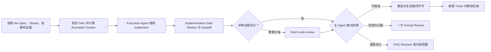

# DAG Skill

`dag-skill` 是一个面向 Agent 的通用协调 Skill，用于持续推进已经批准并拆分完成的 Spec/Ticket 有向无环图。Spec/Ticket 的制定与修改由目标项目的 authoring Skill 完成；单张独立 Ticket 由实施 Skill 直接处理。

可复制 artifact 位于 [`skill/dag/`](./skill/dag/)：英文 [`SKILL.md`](./skill/dag/SKILL.md) 是 DAG 运行规范，[`agents/openai.yaml`](./skill/dag/agents/openai.yaml) 提供可选的 OpenAI/Codex 界面元数据，[`scripts/install_dependencies.py`](./skill/dag/scripts/install_dependencies.py) 提供依赖安装。本文是中文使用说明。

## 启动条件

一次 DAG 运行需要唯一定位：

- 目标项目；
- 已批准的 Spec；
- 本次纳入的 Tickets 与依赖载体；
- 用户对执行、推进、继续或恢复整个 DAG 的授权。

运行规范采用开放的 [Agent Skills 格式](https://agentskills.io/specification)。支持该流程的 Agent 宿主能够激活具名 Skill、派发 fresh 且角色隔离的 Agent、建立实现可写与评审只读边界、观察执行状态，并访问目标项目的 tracker、仓库和验证工具。宿主可以并行调度，也可以在同一契约下串行推进。

## 必需 Skill Bundle

运行环境使用以下四个完整 Matt Skill：

- `implement`
- `code-review`
- `tdd`
- `codebase-design`

默认 Bundle 固定为 [`mattpocock/skills@5b15a47f2d7150f545fbcacbfe381787fc0230dc`](https://github.com/mattpocock/skills/tree/5b15a47f2d7150f545fbcacbfe381787fc0230dc/skills/engineering)。安装助手从 Matt 仓库的 `skills/engineering/<name>` 读取四个完整目录，并分别写入 `<host-skills-root>/<name>`；各 Skill 的配套文件随目录一同安装。

用户单独授权依赖安装并明确宿主的 Skills 根目录后，可以运行：

```bash
python3 /path/to/dag/scripts/install_dependencies.py \
  --skills-root /path/to/agent-host/skills
```

脚本使用 Python 标准库、Git 和网络获取固定 revision。它在写入前比对全部目标：缺失目录进入安装，相同目录标记为 current，内容冲突时保留现状并报告具体目标。`setup-matt-pocock-skills` 属于目标项目配置流程，使用独立授权。

每次启动或恢复时，主 Agent 都会核查四个 Skill 的唯一解析位置、完整资源、固定内容身份、可激活性和实际契约。Bundle 通过后进入 Ticket 调度；修复 Bundle 后会重新验证整个集合。四个目录构成完整 Bundle，Review Agent、Standards Reviewer 和 Spec Reviewer 则是 DAG 派发的角色。

## 模型与 Agent

用户或目标项目明确指定的模型、Agent 或 reasoning effort 构成硬约束。其余情况由主 Agent 依据实时可用性、角色、上下文、工具、Ticket 复杂度和风险选择 Execution Profile：主 Agent 侧重全图推理，实现 Agent 匹配编码工作，Review Agent 使用独立上下文匹配评审面。

当用户希望获得模型建议时，主 Agent 先核查宿主的真实选项，再给出角色分配和取舍。宿主公开的运行元数据会被记录，未公开字段标记为 unknown；精确要求需要替换时，先说明原因并取得授权。

## 核心流程



`implement` 内部的 `code-review` 形成 Implementation-Side Review。主 Agent 检查原始 Standards/Spec 报告、Reviewer 独立性、运行元数据和 Final Artifact Identity；充分证据直接进入裁决，需要补强的证据由 fresh Review Agent 重新评审。

主 Agent 拥有 Ticket 认领、tracker/DAG 状态、集成、接受、返工、修图和最终验收权。Execution Agent 实现一个 Ticket，Reviewer 读取固定产物，所有子 Agent 将产物和证据交回主 Agent。

## 调度、评审与返工

- Runnable Frontier 同时满足已接受依赖、已清除 blocker、当前授权、Agent 能力、证据持久化和安全写边界；tracker 状态字符串是计算输入之一。
- 已在进行的评审、集成和接受优先完成。主 Agent 在当前容量内选择最大的安全 frontier 子集，并在写入关系需要进一步确认时串行推进。
- 每个 workspace 保持一个写入 Agent；目标项目提供隔离 workspace 和显式集成边界时，可以并行实现图上独立的 Tickets。
- 每个直接派发的 Agent 都有有界进展检查点，以 RED、ticket-scoped diff、候选产物、评审报告、明确 blocker 或终态 handoff 作为可观察 milestone。
- 每个 Ticket attempt 共享一次 Operational Retry；每张 Ticket 拥有一次 Formal Rework。
- Ticket 出现新的独立目标、验收 seam 或超出有界评审范围的 diff 时，主 Agent 进入 DAG Revision，选择拆票、新增前置、重排、拒绝、延后或外部阻塞。
- 每条原始 Ticket Lineage 可以自动进行一次保持语义的 DAG Revision；后续修图使用显式用户授权。

候选产物通过 Formal Review 后进入目标项目的 Authoritative Integration Baseline，并在集成后的最终字节和真实交付边界上复验。Ticket 的接受证据持久化并回读成功后，后继节点才会解锁。

迟到的有效 finding 或 Whole-DAG Acceptance Gate 发现的问题会使相关 Ticket 及消费其输出的后继进入重新验证；主 Agent 使用剩余 Formal Rework 或目标项目的 authoring Skill 建立 remediation lineage。

## Skill 复用

验证后的 `implement` 负责 Ticket 实施，并从同一 Bundle 使用 `tdd`、按需使用 `codebase-design`、调用 `code-review` 完成执行侧评审。需要原生适配的场景由主 Agent 公开 DAG-Native Fallback，并用 fresh Agent 保持相同的 TDD、Standards/Spec Review、集成和最终字节门禁。

目标项目的 authoring Skill 负责 DAG Revision 所需的 Ticket 内容；DAG Skill 负责判断何时进入修图以及如何继续调度。

## 授权边界

DAG Run Authorization 覆盖本地认领、Agent 分派、ticket-scoped candidate branch/worktree、代码修改、测试、合适场景下的 ticket-scoped commit、本地票据证据和后继解锁。

远端 tracker 写入、push、PR、tag、release、部署、外部 API 或数据库写入、状态型远端 CI、破坏性 Git、产品语义或验收变化以及降低门禁使用单独授权。

## 终态

- `Complete`：有效图中的所有 Tickets 已集成并接受，Whole-DAG Acceptance Gate 覆盖 Spec、依赖输出、最终产物、项目门禁和 tracker 一致性。
- `Stalled`：有效图仍有未完成 Tickets，运行中的 Agent 数量为零，Runnable Frontier 为空，每条停止路径都有 live 证据。

`Complete` 表示本地验收完成；发布仍使用独立授权。

## 调用示例

- “使用 dag Skill 执行 Spec 0008 已批准的 Ticket DAG。”
- “继续推进这个 DAG，自动调度所有可运行 Tickets。”
- “根据 live tracker 和 Git 证据恢复上次的 DAG 执行。”
