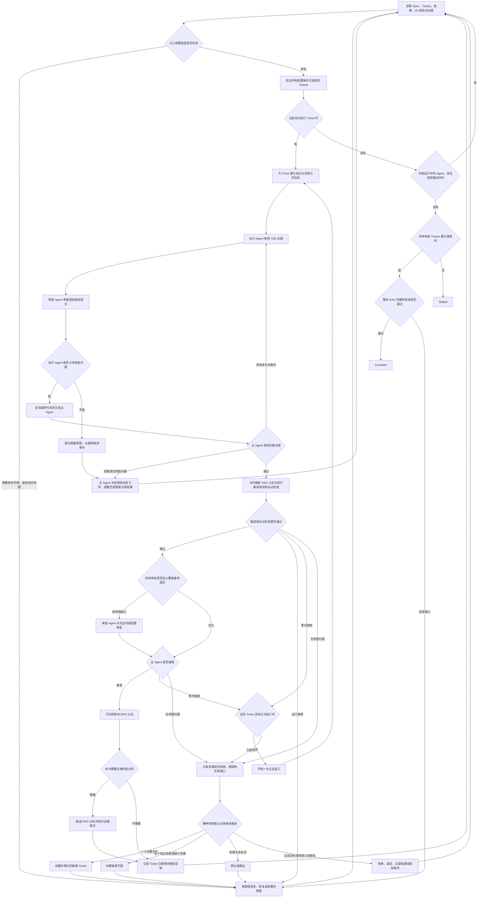

# DAG Skill

`dag-skill` 是一个可以跨项目、跨 Agent 宿主复用的协调 Skill，用来持续推进一个已经设计并批准好的任务图（Ticket DAG）。这里的 DAG 是有向无环图：每张 Ticket 是一个节点；当后一张 Ticket 必须使用前一张 Ticket 已验收的产物时，两者之间才有一条依赖边。

运行时，主 Agent 会反复读取项目的真实状态，找出当前可以开始的 Tickets，派发执行 Agent，核验实施和审查证据，把通过验收的改动合入本次 DAG 的集成分支，再解锁后继 Tickets。这个循环会一直继续，直到整张图完成，或者已有证据证明当前无法再推进。

DAG Skill 负责执行和协调整张图。Spec 与 Ticket 的制定、拆分和内容修订继续遵循目标项目原有的流程。

可安装的 Skill 位于 [`skill/dag/`](./skill/dag/)：[`SKILL.md`](./skill/dag/SKILL.md) 定义准确的运行规则，[`scripts/install_dependencies.py`](./skill/dag/scripts/install_dependencies.py) 安装固定版本的支持 Skills，[`agents/openai.yaml`](./skill/dag/agents/openai.yaml) 提供可选的宿主界面信息。

运行规范采用开放的 [Agent Skills 格式](https://agentskills.io/specification)，任何能够提供所需 Agent 隔离、项目访问和验证能力的宿主都可以接入。

## 项目文档

- [`docs/DESIGN.md`](./docs/DESIGN.md)：解释设计选择、角色边界和状态变化。
- [`CONTEXT.md`](./CONTEXT.md)：记录运行规范中使用的正式术语。
- [`CHANGELOG.md`](./CHANGELOG.md)：记录各版本的用户可见变化。

## 开始一次 DAG 运行

开始或恢复运行时，主 Agent 会先从项目的 Spec、Ticket 系统、Git 和测试证据中确认以下信息。能够从现场确认的内容由主 Agent 直接读取，只有无法唯一判断的部分才需要用户补充。

1. **目标项目**：这次工作对应的仓库，以及实际要操作的分支或工作树。
2. **已批准的 Spec**：已经确认可以实施的需求或设计，而不是仍在讨论的草稿。
3. **本次 Tickets、依赖关系及其权威来源**：要推进哪些 Tickets，以及 Ticket 内容、状态和依赖记录在哪里。它可以是仓库内的 Markdown、GitHub Issues、Jira 或目标项目采用的其他系统。
4. **每张 Ticket 的公开验收入口**：至少有一个能够从公开行为验证结果的入口，例如 CLI 命令、HTTP API、公开函数、配置接口或输出校验器。运行规范把它称为 `public test seam`；它指“从哪里触发并观察行为”，不是某一条具体测试。
5. **整张 DAG 的运行授权**：用户已经同意主 Agent 执行、继续或恢复这批 Tickets。该授权覆盖正常的本地协调操作；远端发布和其他高影响操作使用单独授权。

Git 项目还会确认本次工作的起点和 DAG 集成分支。项目存在可写远端仓库（remote）时，主 Agent 会明确远端名称、远端 DAG 分支，以及本次运行是否允许在里程碑处推送该分支。

宿主需要能够派发彼此隔离的 Agent、为执行 Agent 提供可写工作区、为审查 Agent 提供只读边界，并允许主 Agent 观察 Agent 状态和访问目标项目的 Ticket 系统、仓库及验证工具。宿主只支持串行派发时，DAG 也可以串行运行。

## 三类 Agent

一次 DAG 运行只使用三种 Agent 角色。角色类型是固定的，执行 Agent 和审查 Agent 可以根据并行 Ticket 和审查范围创建多个实例。

| 角色 | 责任 |
| --- | --- |
| **主 Agent（`Coordinator Agent`）** | 每次 DAG 运行一个；负责现场对账、计算可执行节点、调度、证据裁决、集成、正式返工、调整任务图和最终验收。 |
| **执行 Agent（`Execution Agent`）** | 一个实例只推进一张 Ticket；负责 TDD 实施、交接前审查闭环、修复、复验和实施交接。 |
| **审查 Agent（`Review Agent`）** | 独立审查一个固定候选对象，覆盖 Standards、Spec 或明确的定向范围，并返回发现和证据。 |

主 Agent 决定 Ticket 是否接受、是否正式返工以及任务图如何继续。执行 Agent 负责关闭成立的票内问题；审查 Agent 保持只读和独立。`Ticket Worker Protocol` 和 `Worker Self-Check` 是执行 Agent 的工作流程，Standards 和 Spec 是审查 Agent 的审查轴。

## 需要的支持 Skills

DAG 运行使用三个固定版本的 Matt Skills：

- `tdd`：从 Ticket 的公开验收入口开始，用测试驱动实施；
- `code-review`：对固定的候选提交分别进行 Standards 和 Spec 审查；
- `codebase-design`：在需要判断接口、模块边界或测试入口时提供统一的设计原则。

同一支持包还包含 `setup-matt-pocock-skills`，负责为需要它的目标项目一次性生成 Matt Skills 共用的项目配置，例如 `code-review` 用于定位 Issue 和 Spec 的 `docs/agents/issue-tracker.md`。支持包固定在 [`mattpocock/skills@5b15a47f2d7150f545fbcacbfe381787fc0230dc`](https://github.com/mattpocock/skills/tree/5b15a47f2d7150f545fbcacbfe381787fc0230dc/skills/engineering)。安装后，四个完整目录会直接位于宿主的 Skills 根目录下，并保留各自的配套文件。

用户授权安装并给出宿主的 Skills 根目录后，可以运行：

```bash
python3 /path/to/dag/scripts/install_dependencies.py \
  --skills-root /path/to/agent-host/skills
```

安装脚本使用 Python 3.12+ 标准库。它会校验固定版本的文件内容，复用已经完整安装的目录，并在缺少目录时获取固定提交。主 Agent 随后会实际核验这些 Skills 能否被当前宿主调用，并检查目标项目是否已经具备所需配置。配置齐全时直接继续；需要首次配置时，用户运行一次 `setup-matt-pocock-skills`，主 Agent 回读结果后继续调度。

## Agent 和模型怎么选

用户或目标项目明确指定的模型、Agent 或推理强度（reasoning effort）是必须满足的条件。没有精确指定时，主 Agent 根据宿主当前可用能力、角色、Ticket 难度和风险选择合适的 Agent。

运行记录只写宿主真实公开的模型和运行信息；宿主没有公开的字段会记为 `unknown`。如果无法满足用户指定的精确配置，主 Agent 会说明当前可用选择及影响，并在取得同意后再替换。

## 开跑前先核对现场

主 Agent 在领取任何 Ticket 前，会重新读取最新的 Spec、Tickets、依赖、Git、测试和已有审查证据。聊天记录可以帮助定位信息，但项目现场才是状态依据。

入口检查发现问题时，主 Agent 按原因继续处理：

- **当前机器或工具环境不同**：建立项目认可的可复现环境，再运行同一项检查。
- **项目起点本身有缺陷**：按照目标项目流程增加最小的前置修复 Ticket。
- **Ticket 内容、验收入口或依赖关系有误**：在保持已批准语义的前提下调整受影响的图。
- **需要改变产品语义、验收标准、必须通过的质量检查或高影响权限**：记录受影响节点和继续条件，向用户取得授权。
- **原因还不清楚**：暂不领取受影响节点，继续取证，同时推进与它无关的 Tickets。

只要仍有 Agent 在工作，或者主 Agent 还有获授权的修复、恢复或调整任务图的路径，整张 DAG 就会继续运行。

## 整体流程



这张图可以概括为一句话：**读取现场 → 找出能做的票 → 独立实施和审查 → 主 Agent 验收并集成 → 解锁后继 → 重新读取现场。**

“当前可以开始的 Tickets”在运行规范中称为 `Runnable Frontier`。它不是简单读取一个 `ready` 状态：一张票只有在依赖它的前置产物已经验收、阻塞已经解除、工作区不会互相覆盖，并且所需权限和 Agent 能力都满足时才可以派发。图上互不依赖的 Tickets 可以在宿主容量允许时一起派发。

## 一张 Ticket 怎么完成闭环

1. 主 Agent 从当前已验收的 DAG 集成分支创建 Ticket 分支和独立 worktree，也就是为这张票准备一个互不干扰的 Git 工作目录。
2. 一个使用全新独立上下文的执行 Agent 只负责这一张 Ticket，并重新读取它的最新内容、依赖、验收要求和代码起点。全新上下文不要求更换模型。
3. 执行 Agent 使用 `tdd` 从公开验收入口开始实施，并运行 Ticket 约定必须通过的测试和检查。
4. 执行 Agent 固定一个待审提交，请求一次完整且独立的 `code-review`，由审查 Agent 分别检查项目规范（Standards）和 Ticket 要求（Spec）。
5. 执行 Agent 逐条处理成立的问题：行为问题用能够证明“修复前失败、修复后通过”的测试闭环，其他问题提供同等清晰的前后证据，然后重新运行受影响的测试和最终检查。
6. 执行 Agent 把最终提交、原始审查报告、问题处理结果、测试结果和剩余阻塞一起交给主 Agent。无法在当前检查点关闭时，也要返回可核验的阻塞证据，而不是只报告“失败了”。
7. 主 Agent 先核验这次实施交接，再把候选提交对齐到最新 DAG 分支并运行集成测试和其他必过检查。
8. 修复完成后，主 Agent 根据最终改动决定后续审查范围：现有证据完整覆盖最终提交时直接裁决，存在明确缺口时增加定向独立审查，无法确定覆盖范围时重新进行一次完整的独立审查。
9. 主 Agent 根据最终证据选择接受、正式返工、调整任务图、拒绝、延后或记录外部阻塞。执行 Agent 和审查 Agent 提供的结论会由主 Agent 结合现场证据裁决。

这套流程让执行 Agent 在交付前完成“实施—独立审查—修复—复验”闭环，同时保留主 Agent 对是否需要更多审查以及整张图是否推进的最终裁决权。

## Git 如何隔离和集成

一次 Git DAG 运行使用一条专门的 **DAG 集成分支**，并在主 Agent 自己的 worktree 中管理。worktree 是同一仓库的独立 Git 工作目录。每张正在实施的 Ticket 都从该分支当前已验收的最新提交创建独立分支和 worktree。

Ticket 实施可以并行，候选对齐、最终审查、合入和远端检查点按顺序完成。只有已经通过本地验收的候选，才会让 DAG 分支只向前移动（fast-forward）；新的分支最新提交就是一个 **DAG 里程碑**。审查通过的提交会原样进入 DAG 分支；代码字节发生变化时，主 Agent 会重新核验受影响的测试和审查覆盖，必要时补充审查，再决定是否接受。

项目配置了可写远端仓库，并且本次运行已经获得远端检查点授权时，每个里程碑会推送到选定的远端 DAG 分支。主 Agent 会回读远端提交编号（SHA），确认它与本地里程碑完全一致，再把 Ticket 标记为已接受并解锁依赖它的后继 Tickets。

远端检查点或项目权威 Ticket 状态尚未确认时，主 Agent 会先完成这项确认，再打开新的 Ticket 工作目录；已经开始且互不依赖的 Ticket 可以继续实施。

远端检查点只发布本次 DAG 分支。把最终结果合入 `main`、创建 PR、打 tag 或发布 release 仍由用户单独授权。

## 失败、返工和调整任务图

不同问题由相应角色处理，主 Agent 负责核验结果并决定流程如何继续：

| 发生的情况 | 主要负责人 | 处理方式 |
| --- | --- | --- |
| 命令、路径或派发请求写错，目标动作实际没有开始 | 发起该动作的 Agent | 主 Agent 确认目标动作没有开始或没有到达预期边界，发起者纠正调用后从原检查点继续 |
| Agent、工具或集成环境发生可定位的运行故障 | 实施故障由执行 Agent 处理；审查故障由审查 Agent 处理；集成故障由主 Agent 处理 | 主 Agent 核实并记录原因；对应负责人修正后重试一次。同一原因再次发生且没有新进展时，主 Agent 记录为运行阻塞 |
| 目标 Ticket 在实施交接前还有成立的票内问题 | 执行 Agent | 继续当前实施轮次，用测试或同等的前后证据关闭问题，重新运行受影响的检查后再交接 |
| 目标 Ticket 的实施交接核验通过后，后续检查确认票内阻断问题 | 主 Agent | 批准一次正式返工，并派发执行 Agent 开始第二个实施轮次 |
| 目标 Ticket 的正式返工仍未通过，或其所在任务图存在结构问题 | 主 Agent | 记录未满足的验收、根因和负责接口，再选择非等价单节点、可独立验收的子图、依赖修正或有证据的处置 |
| 目标 Ticket 需要改变产品语义、验收标准、必须通过的质量检查或远端权限 | 主 Agent 与用户 | 主 Agent 记录受影响节点和继续条件，用户决定是否授权 |


主 Agent 调整任务图时，先记录原 Ticket、未满足的验收要求、问题从哪个公开入口暴露、实际根因、应该负责该约束的接口，以及该 Ticket 演变链上已经失败的方案。然后选择能够让交付继续推进的最小完整结构：

- **一张替换 Ticket**：一个业务约束、一个根因和一个负责接口共同构成一个完整可验收结果。新 Ticket 需要对失败原因采用实质不同的结构处理，例如把分散的正确性约束收敛到统一接口。
- **一个替换子图**：存在多个独立可验收结果，或者确实缺少一个会被后继使用的前置产物。原 Ticket 的每项验收责任只归一个子 Ticket；不承接这些原验收责任的子 Ticket，以交付被明确后继消费的前置产物作为自己的验收责任。消费者可以保留完整的原验收责任，在全部硬前驱接受后，依据这些前置产物、自身产物和公开验收入口完成验收。文件、函数、开发阶段和单条审查意见由所属 Ticket 作为内部实施事项处理。
- **直接修正依赖**：Ticket 内容仍然有效，只需要让依赖边准确表示产物的消费关系。
- **明确处置**：当前没有保持已批准语义的结构路径时，根据证据拒绝、延后、记录阻塞或说明需要的新授权。

新增的公开验收入口用于补全 Ticket 契约，代码差异大小用于确定审查范围。它们在证明确实存在新的独立验收结果、缺少前置、负责接口有误或依赖错误时，才会改变任务图。

如果一个新 Ticket 只是更换了编号或描述，而实际交付目标、验收责任、关键依赖和负责接口与某个已失败的前辈相同，它就是“等价修图”，不会进入 DAG。主 Agent 会保留该方案的证据，再选择真正的结构改进或明确处置。

每张 Ticket 仍然只有一次正式返工，Ticket 演变链不使用固定的修图次数。每次修图都需要通过上述结构进展检查，也不会回到演变链上任何已失败的方案结构。当剩余任务已经是不可再划分的独立验收单元，且没有新的前置、负责接口或依赖修正时，主 Agent 会记录阻塞和恢复条件，让终态判定接手。

调整后的图保持无环，并且重新通过节点、验收入口和依赖检查后才继续调度。被替代的 Ticket 保留来源关系，用于恢复运行和追溯调整原因。

## 授权范围

| 授权 | 覆盖的操作 |
| --- | --- |
| **DAG 运行授权** | 本地领取 Ticket、派发 Agent、创建 DAG/Ticket 分支和 worktree、修改代码、运行测试、创建合适的票内提交、记录本地证据、进行保持语义的本地图调整、集成已验收 Ticket 并解锁后继 |
| **远端检查点授权** | 在本次运行中，把每个 DAG 里程碑以只向前移动的方式推送到一个选定的远端 DAG 分支，并回读核对远端提交编号 |
| **单独授权** | 安装依赖、远端 Ticket 系统写入、其他 push、PR、合入 `main`、tag、release、部署、外部 API 或数据库写入、会改变状态的远端 CI、破坏性 Git、产品语义或验收变化，以及降低必须通过的质量检查 |

新的授权条件以用户指令或目标项目的现行规范为来源。Agent 写入 Ticket 或运行记录的条件，在引用了这些权威来源时才作为授权边界；返工和修图次数作为审计证据。因此，保持已批准语义的本地 DAG Revision 会沿用本次 DAG 运行授权继续推进。

## 什么时候结束

- **`Complete`**：所有仍有效的 Tickets 都已集成并接受；最终验收确认 Spec 覆盖、依赖产物、DAG 分支、项目要求的检查、Ticket 状态和本次要求的远端检查点彼此一致。
- **`Stalled`**：仍有未完成 Tickets，但已经没有运行中的 Agent、当前可执行的 Ticket、获授权的恢复方式，也没有能通过结构进展检查的调图方式；主 Agent 会为每个阻塞记录原因、授权来源和恢复所需条件。

如果仍有 Agent 在运行，或还有获授权的恢复路径，DAG 就处于运行中，而不是 `Stalled`。

## 调用示例

- “使用 dag Skill 执行 Spec 0008 已批准的 Ticket DAG。”
- “继续推进这个 DAG，自动调度所有当前可执行的 Tickets。”
- “根据最新的 Ticket、Git 和测试证据恢复上次的 DAG 执行。”
