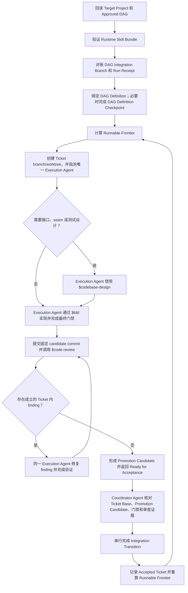

# DAG Skill

`dag-skill` 用于推进 Git 项目中已经批准的多 Ticket 依赖图。`Coordinator Agent` 负责现场对账、调度、验收和集成；`Execution Agent` 一次负责一个 Ticket，持续完成实现、验证、审查和 finding 闭环。

可复制的 Skill 位于 [`skill/dag/`](./skill/dag/)：

- [`SKILL.md`](./skill/dag/SKILL.md) 是运行规范；
- [`references/`](./skill/dag/references/) 保存按运行分支读取的详细契约；
- [`scripts/validate_definition_index.py`](./skill/dag/scripts/validate_definition_index.py) 验证 `DAG Definition Index`；
- [`scripts/install_runtime_skills.py`](./skill/dag/scripts/install_runtime_skills.py) 安装 `Runtime Skill Bundle`。

它只执行已经批准的 `Approved DAG`，不替代 `Target Project` 编写 Spec 或 Ticket。

## 执行 DAG



### 启动与恢复

进入 `Runnable Frontier` 前，`Coordinator Agent` 按顺序完成：

1. 回读 `Target Project` 的指令、Spec、Tickets、tracker、Git、worktrees、测试和已有证据，重建有效 `Approved DAG`。
2. 验证 `Agent Host` 能解析由 `tdd`、`codebase-design` 和 `code-review` 组成的 `Runtime Skill Bundle`；无法解析、缺失或固定身份不一致时运行安装器：

   ```bash
   python3 <this-skill-root>/scripts/install_runtime_skills.py \
     --skills-root /path/to/agent-host/skills
   ```

   安装器只创建缺失且无冲突的 Skill；发现不同版本或不完整目标时保留现场并报告。安装成功后让 `Agent Host` 重新加载 Skill 列表，确认三项 Skill 均可解析。
3. 创建或恢复 `DAG Integration Branch`。新运行从 `Target Project` 授权的 `Starting Base` 创建；恢复时用 `Run Receipt` 对账该分支的本地 ref、`Starting Base`、`Accepted Integration Tip` 和 pending `Integration Transition`。
4. 用内置 validator 对指定 commit 的 `.dag/definition-index.json`、输入 blob 和对象类型做确定性验证并绑定完整 `DAG Definition`。外部 tracker 必须先形成包含完整计划和来源身份的规范化快照；如果 `Starting Base` 或当前 `Accepted Integration Tip` 尚未包含精确输入与等价 index，创建并审查一个 `DAG Definition Checkpoint`。
5. 满足 `Integration Publication Mode` 并计算 `Runnable Frontier`。

### 逐票推进

`Execution Agent` 只返回三种 `Execution Outcome`：

| Execution Outcome | 含义 |
| --- | --- |
| `Ready for Acceptance` | 既有规则已经决定成功路径，只剩 `Coordinator Agent` 的验收或集成动作 |
| `Needs Coordinator Decision` | 还缺 `Hard Dependency`、范围、产品含义、图结构、验收或授权决定 |
| `Externally Blocked` | 决定已经明确，但凭据、服务、硬件或宿主能力尚未满足 |

普通代码缺陷、失败测试、审查 finding 和 `Promotion Candidate` 轮次始终由同一 `Execution Agent` 在 Ticket 内闭环。只有现场证据要求改变 Ticket、`Hard Dependency` 或 `Acceptance Obligation` 时，才进入 `DAG Revision`。

## 核心契约

- `Ticket Base`、最终 `Promotion Candidate`、最终门禁和 `Candidate Review Record` 必须绑定同一组 commit/tree 身份。
- `.dag/definition-index.json` 是唯一 `DAG Definition Index`。若 `Target Project` 禁止该路径，先请求兼容性决定，不创建另一套选择器。
- 只有 `DAG Definition Checkpoint` 可以改变 `DAG Definition Index` 或其输入；`Promotion Candidate` 必须保持这些字节不变，并排除 `Run Receipt` 等运行状态。
- `DAG Revision` 改变 `Accepted Ticket` 或 `Superseded Ticket` 的责任时，旧证据失效；必须重新审计，或按 `Target Project` 规则重新打开/转交给有效 Ticket。
- 同一 Ticket 同时只有一个可写 `Execution Agent`。更换 Agent 前先确认原 Agent 已停止，并交接原 branch、worktree、WIP 和证据。
- 派发 `Execution Agent` 时只传固定单票契约，并使用 `Agent Host` 的零历史设置；不支持时采用排除无关 Ticket、Run Receipt 和既有工具输出的最小历史窗口。
- `Baseline Satisfaction` 只有在 `Target Project` 已有明确规则且证据完整时才能形成成功结果；不制造空提交，也不对空 diff 调用 `$code-review`。
- `Run Receipt` 保存在交付历史之外，并按 `integration-transitions.md` 保存 pending `Integration Transition` 的冻结证据；`DAG Definition Checkpoint` 还要绑定验收影响处置和审计身份。

## 集成发布

每次运行只选择一次 `Integration Publication Mode`：

- 已有可恢复模式时继续使用；
- 用户明确要求同步时选择 `Remote-mirrored`，remote 或分支不明确时只询问缺少的选择；
- 没有 remote 且未要求同步时直接选择 `Local-only`；
- 已配置 remote 但没有同步意图时，询问使用 `Local-only` 还是 `Remote-mirrored`；
- 必须同步但没有 remote 时，先取得 remote 名称、URL 和执行 `git remote add` 的授权。

`Remote-mirrored` 只同步一个专用的 `DAG Integration Branch`。写默认或受保护分支、改用 PR、同步 Ticket 分支、force-push 或切换 ref 都不属于该模式的默认权限。

每个 `Integration Transition` 都先原子推进 `DAG Integration Branch` 的本地 ref 并回读；`Remote-mirrored` 还必须同步固定远端 ref 并确认 SHA 相同。同步未完成时保持 pending，不验收 Ticket、不解锁后继，也不开始下一次 `Integration Transition`。完整恢复算法以 [`integration-transitions.md`](./skill/dag/references/integration-transitions.md) 为准。

## 授权与终态

一次 DAG 执行授权通常覆盖：安全补齐缺失的 `Runtime Skill Bundle`、绑定本地 `DAG Definition`、本地认领和 worktrees、Ticket 内编辑与测试、提交 `Promotion Candidate`、本地 `Integration Transition` 和验收证据。

替换已有 Skill、运行可选项目配置、`git remote add`、其他 push、远端 tracker/PR、tag、release、部署、远端 CI、外部写入、破坏性 Git、修改产品含义或放宽门禁，都需要对应的明确授权。

`Terminal Outcome` 只能是：

- `Complete`：最终 `DAG Definition` 已绑定，所有有效 Ticket 均已成为 `Accepted Ticket`，所有 `Superseded Ticket` 的责任已处置，没有活动认领，整图门禁和依赖消费一致，并满足 `Integration Publication Mode`。
- `Stalled`：所有写入者状态和未决决定都已解决，但未完成工作仍没有运行中 `Execution Agent`、`Runnable Frontier`、获授权恢复、`DAG Revision` 或可满足的外部条件。

## 调用示例

- “使用 dag Skill 执行 Spec 0008 对应的 `Approved DAG`。”
- “继续推进这个 DAG；缺失的运行依赖按默认流程安装。”
- “从最新的 Ticket、Git、worktree 和测试证据恢复 DAG。”

## 项目文档

- [`docs/DESIGN.md`](./docs/DESIGN.md) 解释设计取舍；
- [`CONTEXT.md`](./CONTEXT.md) 定义术语；
- [`CHANGELOG.md`](./CHANGELOG.md) 记录版本变化。
