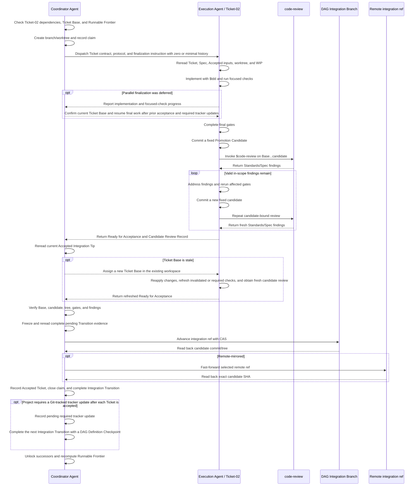

# DAG Skill

English | [简体中文](./README_ZH.md)

`dag-skill` coordinates the execution of approved Ticket dependency graphs in Git projects. The `Coordinator Agent` reconciles live state and owns scheduling, acceptance, and integration. Each `Execution Agent` handles one Ticket at a time, from implementation and validation through review and resolution of findings.

The Skill is packaged in [`skill/dag/`](./skill/dag/):

- [`SKILL.md`](./skill/dag/SKILL.md) defines the operating rules;
- [`references/ticket-execution.md`](./skill/dag/references/ticket-execution.md) is the single-Ticket protocol supplied to each `Execution Agent`;
- [`definition-binding.md`](./skill/dag/references/definition-binding.md) and [`integration-transitions.md`](./skill/dag/references/integration-transitions.md) define Definition binding and integration recovery;
- [`scripts/validate_definition_index.py`](./skill/dag/scripts/validate_definition_index.py) validates the `DAG Definition Index`;
- [`scripts/promote_local_transition.py`](./skill/dag/scripts/promote_local_transition.py) verifies frozen evidence and advances a local integration ref;
- [`scripts/install_runtime_skills.py`](./skill/dag/scripts/install_runtime_skills.py) installs the `Runtime Skill Bundle`.

It executes only an `Approved DAG`. The `Target Project` remains responsible for authoring Specs and Tickets.

## Execute a DAG

### Start or resume

The bundled helpers require Python 3.12+. Resolve and record a compatible executable under the [bootstrap rules](./skill/dag/SKILL.md#bootstrap-the-runtime-skill-bundle), then use it in place of `python3` below.

Before scheduling Tickets from the `Runnable Frontier`, the `Coordinator Agent` completes these steps in order:

1. Reread the current `Target Project` instructions, Specs, Tickets, tracker, Git state, worktrees, tests, and evidence to reconstruct the effective `Approved DAG`. Account for each in-scope Spec obligation through an effective Ticket or an existing whole-DAG gate with a named owner. If the project requires updates to its Git-tracked tracker, confirm their contents, timing after Accepted, Superseded, or reopened dispositions, and necessary write authorization.
2. Verify that the `Agent Host` can resolve all three Skills in the `Runtime Skill Bundle`: `tdd`, `codebase-design`, and `code-review`. The anchored commit is the minimum version: accept that version and descendant versions verified through Git ancestry and complete content checks. If any Skill cannot be resolved, is missing, or has not been verified against this version floor, run the installer:

   ```bash
   python3 <this-skill-root>/scripts/install_runtime_skills.py \
     --skills-root /path/to/agent-host/skills
   ```

   The installer recognizes anchor copies offline. For different contents, it verifies descendant versions, including intermediate revisions, against upstream branch and tag history. It reuses verified newer copies and installs missing Skills from the anchor. Unverifiable, locally modified, or incomplete targets are preserved and reported. After installation succeeds, have the `Agent Host` reload its Skill list, then confirm that all three Skills resolve.

   Supply Runtime Skills with authoritative `Target Project` instructions and inputs. Reviews can use the project's existing tracker workflow; a missing dependency-specific documentation path alone does not require project setup. Resolve actual context gaps specifically, and keep configuration changes within existing authorization boundaries.

   `setup-matt-pocock-skills` is an optional configuration helper. The `Coordinator Agent` installs a missing copy with `--include-setup-helper` only when the user explicitly requests installation or when it is needed for project configuration already authorized through the helper. Existing authorization applies within its scope; an installation-only request does not authorize project configuration.
3. Create or restore the `DAG Integration Branch`. For a new run, create it from the `Starting Base` authorized by the `Target Project`. When resuming, use the `Run Receipt` to reconcile the branch's local ref, `Starting Base`, `Accepted Integration Tip`, and any pending `Integration Transition`.
4. Use the bundled validator to deterministically verify `.dag/definition-index.json`, input blobs, and object types at the specified commit, and bind the complete `DAG Definition`. For an external tracker, first create a normalized snapshot containing the complete plan and its source identities. If the `Starting Base` or current `Accepted Integration Tip` does not yet contain the exact inputs and an equivalent index, create and review a `DAG Definition Checkpoint`.
5. Meet the requirements of the `Integration Publication Mode` and compute the `Runnable Frontier`.

### Advance each Ticket

By default, the same `Execution Agent` handles routine work within the Ticket: fixing code defects and failing tests, resolving review findings, and iterating on the `Promotion Candidate`. The `Coordinator Agent` initiates a `DAG Revision` under the `Target Project` rules only when live evidence shows that effective Tickets, a `Hard Dependency`, or an `Acceptance Obligation` must change.

The Coordinator dispatches the fixed Ticket contract, the [Ticket execution protocol](./skill/dag/references/ticket-execution.md), and an explicit finalization instruction with zero or minimal relevant history. The protocol defines the engineering loop, Runtime Skill input and evidence rules, and handoff requirements; the contract supplies applicable user and project constraints and scoped approval pointers. Each Agent reconstructs its context from authoritative inputs and the assigned workspace. Optional [shared exploration notes](./skill/dag/SKILL.md#dispatch-the-fixed-ticket-contract) can support repeated investigation; consumers verify facts that affect implementation or acceptance against authoritative sources.

Prefer parallel implementation and focused checks when delivery changes and runtime resources are demonstrably independent or isolated, and host capacity leaves room for downstream Runtime Skill Agents. This includes backfilling one Runnable Ticket alongside an existing live claim. At each claim or resume, apply the [scheduling criteria](./skill/dag/SKILL.md#compute-and-claim-the-runnable-frontier) to proposed assignments together with existing live claims and their actual resource occupancy, including deferred work. Otherwise proceed serially; separate worktrees alone do not prove independence. A serial assignment authorizes final gates and review directly. If parallel finalization is deferred, the Coordinator confirms the current `Ticket Base` after preceding acceptance and required tracker updates before resuming it. Keep the same owner and workspace, let other eligible work proceed during long repairs, and always serialize integration and acceptance. Waiting for deferred finalization is scheduling, not an `Execution Outcome`.

When it can hand off a stable result, the `Execution Agent` returns exactly one of the following `Execution Outcome` values:

| Execution Outcome | Meaning |
| --- | --- |
| `Ready for Acceptance` | Evidence for a `Promotion Candidate` or `Baseline Satisfaction` is complete, and no new decisions about the product, scope, graph structure, or authorization are needed. The `Coordinator Agent` still needs to verify the evidence and perform the applicable acceptance or integration actions. |
| `Needs Decision` | The Ticket still requires a specific decision about a `Hard Dependency`, ownership of acceptance obligations, product semantics, scope, graph structure, or authorization. The `Coordinator Agent` resolves it within existing authority or asks the user to decide. |
| `Externally Blocked` | Required decisions are settled, but an external prerequisite is still missing, such as credentials, a service, hardware, an `Agent Host` capability, or required authorization. |

These `Execution Outcome` values are handoff results from the `Execution Agent`, not Ticket states. The `Coordinator Agent` still records acceptance and graph state. The diagram below shows the normal `Promotion Candidate` sequence: after completing work on the Ticket, the `Execution Agent` hands it off as `Ready for Acceptance`, and the `Coordinator Agent` completes Ticket acceptance.


```mermaid
sequenceDiagram
    participant C as Coordinator Agent
    participant E as Execution Agent / Ticket-02
    participant R as code-review
    participant I as DAG Integration Branch
    participant M as Remote integration ref

    C->>C: Check Ticket-02 dependencies, Ticket Base, and Runnable Frontier
    C->>C: Create branch/worktree and record claim
    C->>E: Dispatch Ticket contract, protocol, and finalization instruction with zero or minimal history

    E->>E: Reread Ticket, Spec, Accepted inputs, worktree, and WIP
    E->>E: Implement with $tdd and run focused checks
    opt Parallel finalization was deferred
        E-->>C: Report implementation and focused-check progress
        C-->>E: Confirm current Ticket Base and resume final work after prior acceptance and required tracker updates
    end
    E->>E: Complete final gates
    E->>E: Commit a fixed Promotion Candidate
    E->>R: Invoke $code-review on Base...candidate
    R-->>E: Return Standards/Spec findings

    loop Valid in-scope findings remain
        E->>E: Address findings and rerun affected gates
        E->>E: Commit a new fixed candidate
        E->>R: Repeat candidate-bound review
        R-->>E: Return fresh Standards/Spec findings
    end

    E-->>C: Return Ready for Acceptance and Candidate Review Record
    C->>C: Reread current Accepted Integration Tip

    opt Ticket Base is stale
        C-->>E: Assign a new Ticket Base in the existing workspace
        E->>E: Reapply changes, refresh invalidated or required checks, and obtain fresh candidate review
        E-->>C: Return refreshed Ready for Acceptance
    end

    C->>C: Verify Base, candidate, tree, gates, and findings
    C->>C: Freeze and reread complete pending Transition evidence
    C->>I: Advance integration ref with CAS
    I-->>C: Read back candidate commit/tree

    opt Remote-mirrored
        C->>M: Fast-forward selected remote ref
        M-->>C: Read back exact candidate SHA
    end

    C->>C: Record Accepted Ticket, close claim, and complete Integration Transition

    opt Project requires a Git-tracked tracker update after each Ticket is accepted
        C->>C: Record pending required tracker update
        C->>C: Complete the next Integration Transition with a DAG Definition Checkpoint
    end

    C->>C: Unlock successors and recompute Runnable Frontier
```

## Core contracts

- The `Ticket Base`, final `Promotion Candidate`, current gate evidence, and `Candidate Review Record` must agree on the evaluated artifact identities. Reuse unchanged product gates only with their original identities and a fresh equivalence and impact audit; rerun invalidated and project-required candidate-specific checks. Every new candidate receives fresh review.
- `.dag/definition-index.json` is the only `DAG Definition Index`. If the `Target Project` prohibits that path, request a compatibility decision before proceeding; do not create an alternative selector.
- Only a `DAG Definition Checkpoint` may change the `DAG Definition Index` or its inputs. A `Promotion Candidate` must preserve those bytes and exclude runtime state such as the `Run Receipt`.
- When a `DAG Revision` changes the obligations of an `Accepted Ticket` or `Superseded Ticket`, the old evidence becomes invalid. Audit the affected obligations again, reopen the affected Tickets, or transfer their obligations to effective Tickets under the `Target Project` rules.
- A proven defect in an unchanged Accepted obligation follows the [responsible Ticket's repair path](./skill/dag/SKILL.md#reopen-a-failed-accepted-obligation). Complete required tracker checkpoints before restoring its claim from the current `Accepted Integration Tip`; preserve history and process only affected consumers.
- Each Ticket has at most one write-capable `Execution Agent` at a time. Before replacing an Agent, confirm that the previous Agent has stopped and hand over its branch, worktree, WIP, and evidence.
- `Baseline Satisfaction` requires an explicit existing acceptance rule in the Approved Ticket or `Target Project` and complete evidence for every obligation. Verification, audit, or operational deliverables may supply that rule without another approval merely for an empty product diff. Green tests alone do not satisfy an implementation Ticket; current Base/tree, authority, and actual deliverables still govern. Do not create empty commits or invoke `$code-review` on an empty diff.
- For an authorized zero-diff external operation whose result is unknown, [correlate and read back the original action before retrying](./skill/dag/references/ticket-execution.md#gather-zero-diff-evidence). A lost response or temporarily missing result does not prove that no side effect occurred.
- Apply project-required stable tracker updates through a `DAG Definition Checkpoint` under the [tracker sequencing rules](./skill/dag/SKILL.md#persist-target-project-required-stable-tracker-evidence). A change to any selected Definition input requires complete rebinding and an acceptance-impact audit; unchanged Definition identities allow review focused on the stable audit changes.

## Integration and publication

Choose an `Integration Publication Mode` once per run:

- If the run's mode can be recovered from its records or project instructions, continue using it.
- Choose `Remote-mirrored` when the user or project explicitly requires synchronization. If the remote or branch is ambiguous, ask only for the missing choice.
- Choose `Local-only` when synchronization has not been requested, including when remotes are configured.
- If synchronization is required but no remote exists, first obtain the remote name, URL, and authority to run `git remote add`.

`Remote-mirrored` synchronizes only one dedicated `DAG Integration Branch`. The mode does not by itself authorize writing to default or protected branches, switching to a PR workflow, synchronizing Ticket branches, force-pushing, or changing refs.

The [integration reference](./skill/dag/references/integration-transitions.md) defines the off-delivery `Run Receipt`, frozen pending evidence, compare-and-swap, and local or remote recovery. The narrow [`scripts/promote_local_transition.py`](./skill/dag/scripts/promote_local_transition.py) helper verifies and advances only the local ref; publication and acceptance remain Coordinator responsibilities. `Remote-mirrored` requires exact remote SHA readback before accepting a Ticket, unlocking successors, or starting another `Integration Transition`. Recovery preserves that mode, and release authority remains separate from integration mirroring.

## Authorization and terminal outcomes

Authorization to execute a DAG normally covers safely installing missing members of the `Runtime Skill Bundle`, binding the local `DAG Definition`, claiming Tickets and creating worktrees locally, editing and testing within a Ticket, committing a `Promotion Candidate`, carrying out local `Integration Transition` operations, and recording acceptance evidence.

Explicit authorization is required for replacing existing Skills, running optional project setup, `git remote add`, other pushes, remote tracker or PR operations, tags, releases, deployments, remote CI, external writes, destructive Git operations, changes to product meaning, and weakening gates.

The only `Terminal Outcome` values are:

- `Complete`: The final `DAG Definition` is bound, every in-scope Spec obligation has an accountable delivery path, and its evidence remains applicable to the final `Accepted Integration Tip`. Every effective Ticket is an `Accepted Ticket`, all `Superseded Ticket` obligations are resolved, and no active claims remain. Whole-graph gates and dependency consumption are consistent, no unresolved defect or evidence gap remains, the requirements of the `Integration Publication Mode` are met, and any project-required Git-tracked tracker matches the final DAG state. The [completion rules](./skill/dag/SKILL.md#resume-safely-and-finish) preserve original evidence identities and require affected or project-required checks to run again.
- `Stalled`: The running status of every writer has been verified, and all pending decisions affecting DAG execution or acceptance are resolved. No `Execution Agent` is working on the unfinished Tickets, none of those Tickets are in the `Runnable Frontier`, and no authorized recovery, `DAG Revision`, or currently satisfiable external condition can enable further progress.

Report run-owned resources as disposed, retained, or pending separately from `Complete` or `Stalled`. Reclamation follows existing authority and preserves live writers, unrelated resources, unique WIP, and required acceptance or recovery evidence; pending disposal alone does not change the Terminal Outcome.

## Example requests

- "Use the dag Skill to execute the `Approved DAG` for Spec 0008."
- "Continue executing this DAG. Install any missing runtime dependencies using the default workflow."
- "Resume the DAG using the latest evidence from Tickets, Git, worktrees, and tests."

## Project documentation

- [`docs/DESIGN.md`](./docs/DESIGN.md) explains design decisions;
- [`CONTEXT.md`](./CONTEXT.md) defines the terminology;
- [`CHANGELOG.md`](./CHANGELOG.md) records version changes.
