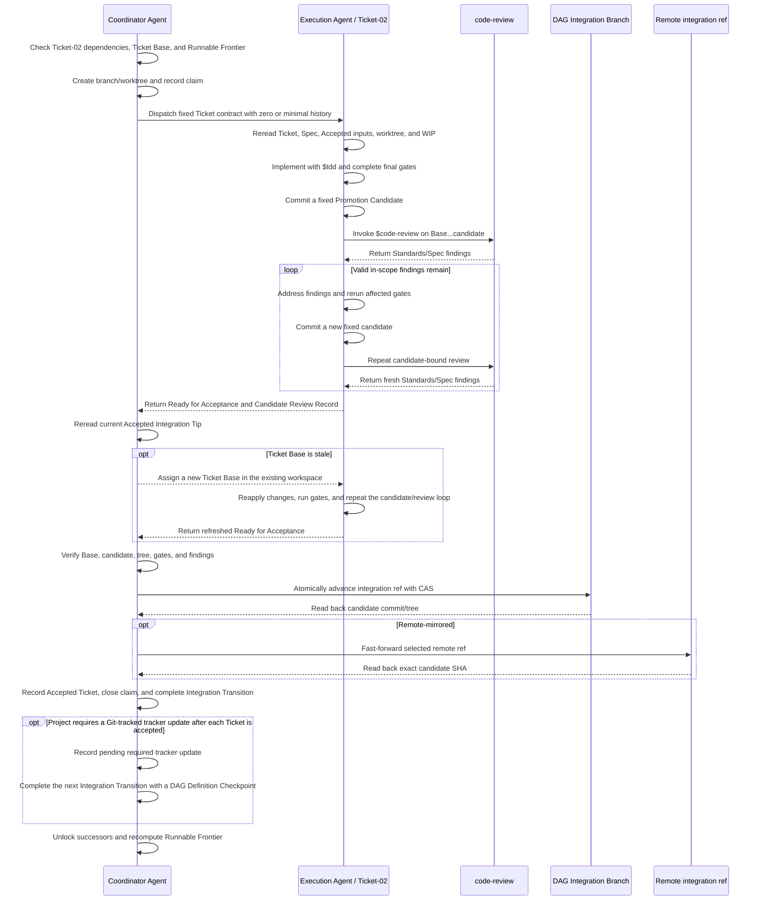

# DAG Skill

[中文](./README.md) | English

`dag-skill` coordinates the execution of approved Ticket dependency graphs in Git projects. The `Coordinator Agent` reconciles live state and owns scheduling, acceptance, and integration. Each `Execution Agent` handles one Ticket at a time, from implementation and validation through review and resolution of findings.

The Skill is packaged in [`skill/dag/`](./skill/dag/):

- [`SKILL.md`](./skill/dag/SKILL.md) defines the operating rules;
- [`references/`](./skill/dag/references/) provides detailed contracts for specific workflow paths;
- [`scripts/validate_definition_index.py`](./skill/dag/scripts/validate_definition_index.py) validates the `DAG Definition Index`;
- [`scripts/install_runtime_skills.py`](./skill/dag/scripts/install_runtime_skills.py) installs the `Runtime Skill Bundle`.

It executes only an `Approved DAG`. The `Target Project` remains responsible for authoring Specs and Tickets.

## Execute a DAG

### Start or resume

Before scheduling Tickets from the `Runnable Frontier`, the `Coordinator Agent` completes these steps in order:

1. Reread the current `Target Project` instructions, Specs, Tickets, tracker, Git state, worktrees, tests, and evidence to reconstruct the effective `Approved DAG`. If the project requires updates to its Git-tracked tracker, confirm what must be updated, when the update is due after a Ticket becomes an `Accepted Ticket` or `Superseded Ticket`, and whether the necessary write authorization is in place.
2. Verify that the `Agent Host` can resolve all three Skills in the `Runtime Skill Bundle`: `tdd`, `codebase-design`, and `code-review`. If any Skill cannot be resolved, is missing, or does not match its pinned identity, run the installer:

   ```bash
   python3 <this-skill-root>/scripts/install_runtime_skills.py \
     --skills-root /path/to/agent-host/skills
   ```

   The installer adds missing Skills only when there are no conflicts. If it finds an existing installation with a different version or incomplete contents, it leaves it unchanged and reports the conflict. After installation succeeds, have the `Agent Host` reload its Skill list, then confirm that all three Skills resolve.
3. Create or restore the `DAG Integration Branch`. For a new run, create it from the `Starting Base` authorized by the `Target Project`. When resuming, use the `Run Receipt` to reconcile the branch's local ref, `Starting Base`, `Accepted Integration Tip`, and any pending `Integration Transition`.
4. Use the bundled validator to deterministically verify `.dag/definition-index.json`, input blobs, and object types at the specified commit, and bind the complete `DAG Definition`. For an external tracker, first create a normalized snapshot containing the complete plan and its source identities. If the `Starting Base` or current `Accepted Integration Tip` does not yet contain the exact inputs and an equivalent index, create and review a `DAG Definition Checkpoint`.
5. Meet the requirements of the `Integration Publication Mode` and compute the `Runnable Frontier`.

### Advance each Ticket

By default, the same `Execution Agent` handles routine work within the Ticket: fixing code defects and failing tests, resolving review findings, and iterating on the `Promotion Candidate`. The `Coordinator Agent` initiates a `DAG Revision` under the `Target Project` rules only when live evidence shows that effective Tickets, a `Hard Dependency`, or an `Acceptance Obligation` must change.

When it can hand off a stable result, the `Execution Agent` returns exactly one of the following `Execution Outcome` values:

| Execution Outcome | Meaning |
| --- | --- |
| `Ready for Acceptance` | Evidence for a `Promotion Candidate` or `Baseline Satisfaction` is complete, and no new decisions about the product, scope, graph structure, or authorization are needed. The `Coordinator Agent` still needs to verify the evidence and perform the applicable acceptance or integration actions. |
| `Needs Decision` | The Ticket still requires a specific decision about a `Hard Dependency`, ownership of acceptance obligations, product semantics, scope, graph structure, or authorization. The `Coordinator Agent` resolves it within existing authority or asks the user to decide. |
| `Externally Blocked` | Required decisions are settled, but an external prerequisite is still missing, such as credentials, a service, hardware, an `Agent Host` capability, or required authorization. |

These `Execution Outcome` values are handoff results from the `Execution Agent`, not Ticket states. The `Coordinator Agent` still records acceptance and graph state. The diagram below shows the normal `Promotion Candidate` sequence: after completing work on the Ticket, the `Execution Agent` hands it off as `Ready for Acceptance`, and the `Coordinator Agent` completes Ticket acceptance.



## Core contracts

- The `Ticket Base`, final `Promotion Candidate`, final gates, and `Candidate Review Record` must be bound to the same set of commit/tree identities.
- `.dag/definition-index.json` is the only `DAG Definition Index`. If the `Target Project` prohibits that path, request a compatibility decision before proceeding; do not create an alternative selector.
- Only a `DAG Definition Checkpoint` may change the `DAG Definition Index` or its inputs. A `Promotion Candidate` must preserve those bytes and exclude runtime state such as the `Run Receipt`.
- When a `DAG Revision` changes the obligations of an `Accepted Ticket` or `Superseded Ticket`, the old evidence becomes invalid. Audit the affected obligations again, reopen the affected Tickets, or transfer their obligations to effective Tickets under the `Target Project` rules.
- Each Ticket has at most one write-capable `Execution Agent` at a time. Before replacing an Agent, confirm that the previous Agent has stopped and hand over its branch, worktree, WIP, and evidence.
- Dispatch an `Execution Agent` with only the fixed contract for one Ticket, using the `Agent Host`'s zero-history setting. If unavailable, use a minimal history window that excludes unrelated Tickets, the Run Receipt, and prior tool output.
- `Baseline Satisfaction` can produce a successful outcome only under explicit existing `Target Project` rules and with complete evidence. Do not create empty commits or invoke `$code-review` on an empty diff.
- Keep the `Run Receipt` outside delivery history and preserve frozen evidence for any pending `Integration Transition` as required by `integration-transitions.md`. A `DAG Definition Checkpoint` must also bind acceptance-impact dispositions and audit identities.
- If the `Target Project` requires updates to its Git-tracked tracker, complete the current acceptance or `Integration Transition` first. While the update has no candidate, record it as a pending required tracker update. Once a candidate exists, track it only as a typed `DAG Definition Checkpoint` Transition. If the update touches a selected Definition input, rebind the index and audit acceptance impact; it cannot be treated as a state-only update.

## Integration and publication

Choose an `Integration Publication Mode` once per run:

- If the run's mode can be recovered from its records, continue using it.
- Choose `Remote-mirrored` when the user explicitly requests synchronization. If the remote or branch is ambiguous, ask only for the missing choice.
- Choose `Local-only` when no remote is configured and synchronization has not been requested.
- If a remote is configured but synchronization has not been requested, ask whether to use `Local-only` or `Remote-mirrored`.
- If synchronization is required but no remote exists, first obtain the remote name, URL, and authority to run `git remote add`.

`Remote-mirrored` synchronizes only one dedicated `DAG Integration Branch`. The mode does not by itself authorize writing to default or protected branches, switching to a PR workflow, synchronizing Ticket branches, force-pushing, or changing refs.

Every `Integration Transition` first atomically advances the local ref of the `DAG Integration Branch` and reads it back. In `Remote-mirrored` mode, it must also synchronize the fixed remote ref and verify that its SHA matches the local SHA. If synchronization is incomplete, keep the Transition pending and do not accept the Ticket, unlock successors, or start another `Integration Transition`. See [`integration-transitions.md`](./skill/dag/references/integration-transitions.md) for the complete recovery algorithm.

## Authorization and terminal outcomes

Authorization to execute a DAG normally covers safely installing missing members of the `Runtime Skill Bundle`, binding the local `DAG Definition`, claiming Tickets and creating worktrees locally, editing and testing within a Ticket, committing a `Promotion Candidate`, carrying out local `Integration Transition` operations, and recording acceptance evidence.

Explicit authorization is required for replacing existing Skills, running optional project setup, `git remote add`, other pushes, remote tracker or PR operations, tags, releases, deployments, remote CI, external writes, destructive Git operations, changes to product meaning, and weakening gates.

The only `Terminal Outcome` values are:

- `Complete`: The final `DAG Definition` is bound. Every effective Ticket is an `Accepted Ticket`, all `Superseded Ticket` obligations are resolved, and no active claims remain. Whole-graph gates and dependency consumption are consistent, the requirements of the `Integration Publication Mode` are met, and any project-required Git-tracked tracker matches the final DAG state.
- `Stalled`: The running status of every writer has been verified, and all pending decisions are resolved. No `Execution Agent` is working on the unfinished Tickets, none of those Tickets are in the `Runnable Frontier`, and no authorized recovery, `DAG Revision`, or currently satisfiable external condition can enable further progress.

## Example requests

- "Use the dag Skill to execute the `Approved DAG` for Spec 0008."
- "Continue executing this DAG. Install any missing runtime dependencies using the default workflow."
- "Resume the DAG using the latest evidence from Tickets, Git, worktrees, and tests."

## Project documentation

- [`docs/DESIGN.md`](./docs/DESIGN.md) explains design decisions;
- [`CONTEXT.md`](./CONTEXT.md) defines the terminology;
- [`CHANGELOG.md`](./CHANGELOG.md) records version changes.
