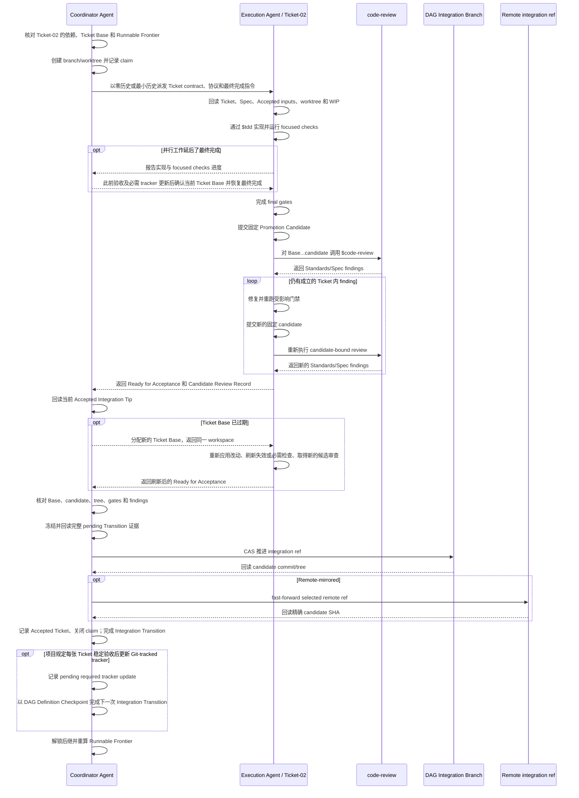

# DAG Skill

简体中文 | [English](./README.md)

`dag-skill` 用于推进 Git 项目中已经批准的多 Ticket 依赖图。`Coordinator Agent` 负责现场对账、调度、验收和集成；`Execution Agent` 一次负责一个 Ticket，持续完成实现、验证、审查和 finding 闭环。

可复制的 Skill 位于 [`skill/dag/`](./skill/dag/)：

- [`SKILL.md`](./skill/dag/SKILL.md) 是运行规范；
- [`references/ticket-execution.md`](./skill/dag/references/ticket-execution.md) 是每个 `Execution Agent` 接收的单票执行协议；
- [`definition-binding.md`](./skill/dag/references/definition-binding.md) 和 [`integration-transitions.md`](./skill/dag/references/integration-transitions.md) 定义 Definition 绑定和集成恢复契约；
- [`scripts/validate_definition_index.py`](./skill/dag/scripts/validate_definition_index.py) 验证 `DAG Definition Index`；
- [`scripts/promote_local_transition.py`](./skill/dag/scripts/promote_local_transition.py) 核验冻结证据并推进本地集成 ref；
- [`scripts/install_runtime_skills.py`](./skill/dag/scripts/install_runtime_skills.py) 安装 `Runtime Skill Bundle`。

它只执行已经批准的 `Approved DAG`，不替代 `Target Project` 编写 Spec 或 Ticket。

## 执行 DAG

### 启动与恢复

进入 `Runnable Frontier` 前，`Coordinator Agent` 按顺序完成：

1. 回读 `Target Project` 的指令、Spec、Tickets、tracker、Git、worktrees、测试和已有证据，重建有效 `Approved DAG`。如果项目要求更新 Git-tracked tracker，则确认在 Ticket 成为 `Accepted Ticket` 或 `Superseded Ticket` 后何时更新、更新什么，以及是否具备写入权限。
2. 验证 `Agent Host` 能解析由 `tdd`、`codebase-design` 和 `code-review` 组成的 `Runtime Skill Bundle`。锚定 commit 是最低版本：接受该版本，以及通过 Git 祖先关系和完整内容核验的后代版本。无法解析、缺失或尚未确认满足最低版本时运行安装器：

   ```bash
   python3 <this-skill-root>/scripts/install_runtime_skills.py \
     --skills-root /path/to/agent-host/skills
   ```

   安装器离线识别锚定副本；内容不同时从上游分支和 tag 历史核验后代版本，包括中间版本。已验证的较新副本直接复用，缺失项仍从锚点补齐；无法核验、有本地修改或不完整的目标保留现场并报告。安装成功后让 `Agent Host` 重新加载 Skill 列表，确认三项 Skill 均可解析。

   调用 Runtime Skills 时提供 `Target Project` 的权威指令和输入。审查可使用项目已有的 tracker 流程；仅缺少依赖约定的文档路径不要求项目配置。真正缺少上下文时补齐具体缺项，配置变更按既有授权边界处理。

   `setup-matt-pocock-skills` 是可选配置辅助技能。用户明确要求安装，或使用它完成已授权的项目配置需要先安装时，`Coordinator Agent` 才通过 `--include-setup-helper` 补齐缺失副本，并沿用已有授权。仅要求安装不授权执行项目配置。
3. 创建或恢复 `DAG Integration Branch`。新运行从 `Target Project` 授权的 `Starting Base` 创建；恢复时用 `Run Receipt` 对账该分支的本地 ref、`Starting Base`、`Accepted Integration Tip` 和 pending `Integration Transition`。
4. 用内置 validator 对指定 commit 的 `.dag/definition-index.json`、输入 blob 和对象类型做确定性验证并绑定完整 `DAG Definition`。外部 tracker 必须先形成包含完整计划和来源身份的规范化快照；如果 `Starting Base` 或当前 `Accepted Integration Tip` 尚未包含精确输入与等价 index，创建并审查一个 `DAG Definition Checkpoint`。
5. 满足 `Integration Publication Mode` 并计算 `Runnable Frontier`。

### 逐票推进

单票执行默认在 Ticket 内闭环：普通代码缺陷、失败测试、审查 finding 和 `Promotion Candidate` 迭代，均由同一 `Execution Agent` 持续处理。只有现场证据表明需要改变有效 Ticket、`Hard Dependency` 或 `Acceptance Obligation` 时，才由 `Coordinator Agent` 按 `Target Project` 的规则发起 `DAG Revision`。

Coordinator 以零历史或最小相关历史派发固定 Ticket contract、[单票执行协议](./skill/dag/references/ticket-execution.md)，以及明确的最终完成指令。协议规定工程闭环、Runtime Skill 输入与证据规则及交接要求；契约提供适用的用户与项目约束，以及已有批准的指针。Agent 从权威输入与分配的 workspace 重建上下文。

至少两张 Ticket 可执行、交付改动与运行资源有证据证明独立或已隔离，并且宿主能为 Runtime Skill 审查预留容量时，优先并行实现和运行 focused checks；否则串行推进。独立 worktree 本身不足以证明独立性；[调度条件](./skill/dag/SKILL.md#compute-and-claim-the-runnable-frontier)覆盖共享接口、配置、文件、端口、设备、数据库和运行目录。串行派发直接授权最终门禁与审查；并行任务若被延后最终完成，则由 Coordinator 在此前验收及必需 tracker 更新完成后确认当前 `Ticket Base`，再恢复执行。保持同一 owner 和 workspace，长期修复期间让其他具备条件的工作继续，集成和验收始终串行。等待延后的最终完成属于调度，不新增 `Execution Outcome`。

当 Ticket 工作可以稳定交接时，`Execution Agent` 只返回以下三种 `Execution Outcome` 之一：

| Execution Outcome | 含义 |
| --- | --- |
| `Ready for Acceptance` | `Promotion Candidate` 或 `Baseline Satisfaction` 的证据已完整，无需新的产品、范围、图结构或授权选择；只剩 `Coordinator Agent` 核验并执行适用的验收或集成动作 |
| `Needs Decision` | Ticket 内仍有关于 `Hard Dependency`、验收责任、产品语义、范围、图结构或授权的明确选择；由 `Coordinator Agent` 在现有权限内处理，否则交由用户决定 |
| `Externally Blocked` | 所需决定已经明确，但仍缺少继续执行所需的外部条件，例如凭据、服务、硬件、`Agent Host` 能力或已要求的授权 |

这些 `Execution Outcome` 只是 `Execution Agent` 的交接结果，不是 Ticket 状态；验收和图状态仍由 `Coordinator Agent` 记录。下图展示 `Promotion Candidate` 路径的正常时序：单票执行完成后以 `Ready for Acceptance` 交接，再由 `Coordinator Agent` 完成 Ticket 验收。



## 核心契约

- `Ticket Base`、最终 `Promotion Candidate`、有效门禁证据和 `Candidate Review Record` 必须与实际评估的 artifact 身份一致。复用未变化的产品门禁时保留原身份并补充新的等价与影响审计；重跑失效检查及项目要求的 candidate-specific checks。每个新 candidate 都接受新的审查。
- `.dag/definition-index.json` 是唯一 `DAG Definition Index`。若 `Target Project` 禁止该路径，先请求兼容性决定，不创建另一套选择器。
- 只有 `DAG Definition Checkpoint` 可以改变 `DAG Definition Index` 或其输入；`Promotion Candidate` 必须保持这些字节不变，并排除 `Run Receipt` 等运行状态。
- `DAG Revision` 改变 `Accepted Ticket` 或 `Superseded Ticket` 的责任时，旧证据失效；必须重新审计，或按 `Target Project` 规则重新打开/转交给有效 Ticket。
- 同一 Ticket 同时只有一个可写 `Execution Agent`。更换 Agent 前先确认原 Agent 已停止，并交接原 branch、worktree、WIP 和证据。
- `Baseline Satisfaction` 要求 Approved Ticket 或 `Target Project` 已有明确规则，并具备逐项满足责任的完整证据。明确的验证、审计或操作交付可构成该规则，无需仅为空产品 diff 再次申请批准。测试通过本身不能满足实现 Ticket；当前 Base/tree、授权和实际交付仍须符合要求。不制造空提交，也不对空 diff 调用 `$code-review`。
- 项目要求的稳定 tracker 更新按[写回顺序](./skill/dag/SKILL.md#persist-target-project-required-stable-tracker-evidence)通过 `DAG Definition Checkpoint` 完成。更新触及已选中的 Definition input 时必须完整重绑并审计验收影响；Definition 身份未变时，审查可以聚焦稳定审计内容的变化。

## 集成发布

每次运行只选择一次 `Integration Publication Mode`：

- 已有可恢复模式或项目规则时继续使用；
- 用户或项目明确要求同步时选择 `Remote-mirrored`，remote 或分支不明确时只询问缺少的选择；
- 没有同步要求时直接选择 `Local-only`，已配置 remote 也遵循该默认值；
- 必须同步但没有 remote 时，先取得 remote 名称、URL 和执行 `git remote add` 的授权。

`Remote-mirrored` 只同步一个专用的 `DAG Integration Branch`。写默认或受保护分支、改用 PR、同步 Ticket 分支、force-push 或切换 ref 都不属于该模式的默认权限。

[集成契约](./skill/dag/references/integration-transitions.md)集中定义交付历史之外的 `Run Receipt`、pending 冻结证据、compare-and-swap，以及本地和远端恢复。`scripts/promote_local_transition.py` 只核验并推进本地 ref；发布与验收仍由 Coordinator 负责。`Remote-mirrored` 必须精确回读远端 SHA 后才能验收 Ticket、解锁后继或启动下一次 `Integration Transition`。恢复沿用该模式，发布授权仍与集成镜像分开。

## 授权与终态

一次 DAG 执行授权通常覆盖：安全补齐缺失的 `Runtime Skill Bundle`、绑定本地 `DAG Definition`、本地认领和 worktrees、Ticket 内编辑与测试、提交 `Promotion Candidate`、本地 `Integration Transition` 和验收证据。

替换已有 Skill、运行可选项目配置、`git remote add`、其他 push、远端 tracker/PR、tag、release、部署、远端 CI、外部写入、破坏性 Git、修改产品含义或放宽门禁，都需要对应的明确授权。

`Terminal Outcome` 只能是：

- `Complete`：最终 `DAG Definition` 已绑定，所有有效 Ticket 均已成为 `Accepted Ticket`，所有 `Superseded Ticket` 的责任已处置，没有活动认领，整图门禁和依赖消费一致，满足 `Integration Publication Mode`，并且项目要求的 Git-tracked tracker 已与最终 DAG 状态一致。
- `Stalled`：所有写入者状态和影响 DAG 执行或验收的未决决定都已解决，但未完成工作仍没有运行中 `Execution Agent`、`Runnable Frontier`、获授权恢复、`DAG Revision` 或可满足的外部条件。

本次资源的已处置、保留或待处理情况与 `Complete`、`Stalled` 分别报告。回收遵守既有授权，保留活动写入者、无关资源、唯一 WIP 及必需验收或恢复证据；待处理资源处置本身不改变 Terminal Outcome。

## 调用示例

- “使用 dag Skill 执行 Spec 0008 对应的 `Approved DAG`。”
- “继续推进这个 DAG；缺失的运行依赖按默认流程安装。”
- “从最新的 Ticket、Git、worktree 和测试证据恢复 DAG。”

## 项目文档

- [`docs/DESIGN.md`](./docs/DESIGN.md) 解释设计取舍；
- [`CONTEXT.md`](./CONTEXT.md) 定义术语；
- [`CHANGELOG.md`](./CHANGELOG.md) 记录版本变化。
